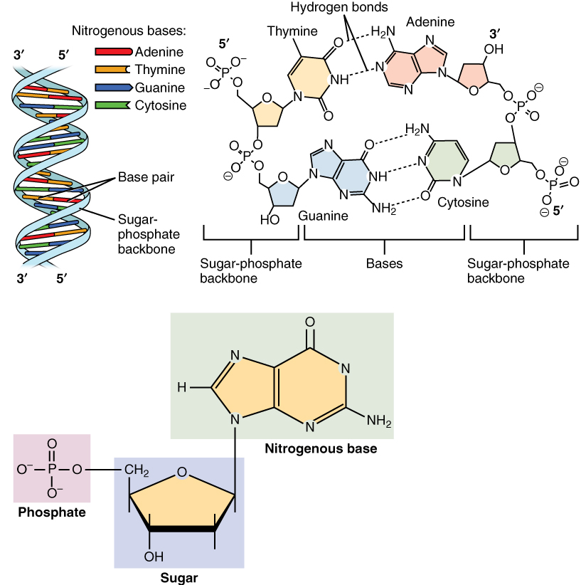
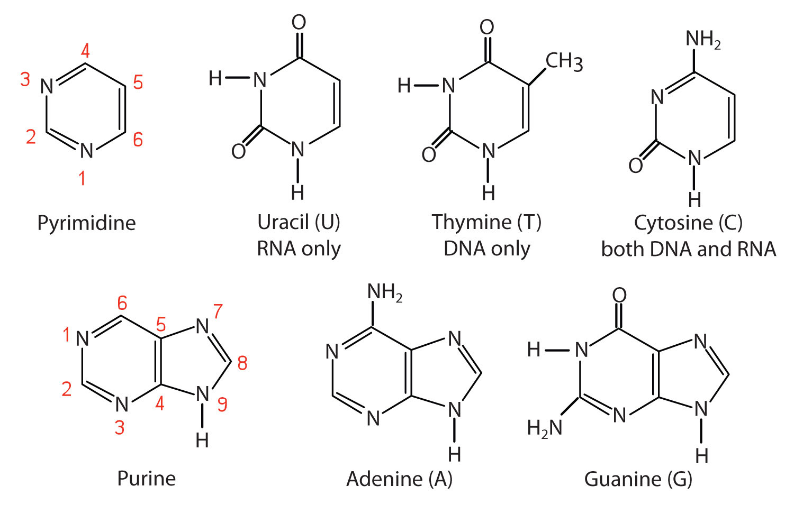

--- 
title: "Drug discovery: a multiscale-modelling approach"
author: "Jitao David Zhang and Philipp Mekler"
date: "`r Sys.Date()`"
site: bookdown::bookdown_site
output:
  bookdown::gitbook:
    css: css/style.css
    config:
      toc:
        before: |
          <li><a href="./">Applied Mathematics and Informatics In Drug Discovery</a></li>
        after: |
          <li><a href="https://github.com/rstudio/bookdown" target="blank">Published with bookdown</a></li>
      download: [pdf, epub, mobi]
      edit: https://github.com/Accio//AMIDD/notes/edit/master/%s
      sharing:
        github: yes
        facebook: no
  bookdown::html_chapters:
    css: [css/style.css, css/toc.css]
  bookdown::pdf_book:
    includes:
      in_header: latex/preamble.tex
    keep_tex: yes
    dev: "cairo_pdf"
    latex_engine: xelatex
    citation_package: natbib
    template: null
    pandoc_args: --top-level-division=chapter
    toc_depth: 3
    toc_unnumbered: no
    toc_appendix: yes
    quote_footer: ["\\VA{", "}{}"]
  bookdown::epub_book:
    dev: svglite
    stylesheet: css/style.css
documentclass: book
bibliography: [book.bib, packages.bib, literature-for-review.bib]
biblio-style: apalike
link-citations: yes
github-repo: accio/Introduction-to-Applied-Mathematics-And-Informatics-In-Drug-Discovery
description: "Lecture notes to the iAMIDD course in autumn semester 2019/2020"
---


```{r include=FALSE}
# automatically create a bib database for R packages
knitr::write_bib(c(
  .packages(), 'bookdown', 'knitr', 'rmarkdown'
), 'packages.bib')
```

<!--chapter:end:index.Rmd-->

---
bibliography: literature-for-review.bibtex
output:
  pdf_document:
    citation_package: natbib
  bookdown::pdf_book:
    citation_package: biblatex
---

# Preface {-}

This document is also the proposal for *Multiscale Modelling in Drug Discovery: An Introduction* (working title), a book that we are writing.

## Modelling in drug discovery

Drug discovery is the activity of identifying chemical or biological entities
that potentially slow down, halt, or even reverse disease progression. Modern
drug discovery has a short history compared with that of human and human
diseases. It has, however, fundamentally changed the life of each of us.

Drug discovery has also changed itself during its development. In its early
years, drug discovery was primarily driven by trials and errors as well as
serendipity in chemistry, biology, and medicine. Today, drug discovery
represents one of the most interdisciplinary and collaborative human research
enterprises. The trial-and-error principle and serendipity still play a role,
because our knowledge in biology is much limited. Nevertheless, as the
techniques of drug discovery develop and refine, mathematical, statistical, and
computational models have become essential besides experimental methods to
predict drug targets, to identify drug molecules, and to describe how drug
works.


What are these models? A mathematical model describes the state and dynamics of
a system. A statistical model represents assumptions about sample data, which
allows us to use data analysis to infer the distribution of variables of
interest. A computational model implements logic in procedures, which simulate
the behaviour of a system.

Examples of these models are introduced throughout the book. There are different
views in the literature on the philosophy of science about whether statistical
and computational models are special forms of mathematical models or they are
distinct forms of conceptual modelling. For our purpose though, it suffices that
we refer to all of them as models and specify the type only in case of
ambiguity.

We apply models for two reasons mainly. First, they allow us to study the human
body as a biochemical system. Since the system is large and complex, we usually
consider part of it. Examples of such sub-systems include the brain suffering
from the Alzheimer's Disease, the lung infected by the coronavirus, and
malignant melanoma, a skin cancer that originates from pigment-producing cells
known as melanocytes. From this perspective, health and diseases are the states
of the system. Models are used to characterize the different states: what
variables are correlated with the states? Which variables are causal,
manipulating of which may worsen or cure the disease? For simplicity, we say
that models serve *disease understanding* in such contexts.

The other main application of models is to study body-drug interactions. While
it is feasible and sometimes helpful to ignore the human body system and model
drug molecules alone, the effectiveness of such models will finally be tested in
the body system. Therefore, even if we start by modelling drug molecules, we
will end up modelling body-drug interactions because they form the mechanistic
basis of the therapeutic use of drugs.

From a system's perspective, the goal of drug discovery is to identify a
perturbation or a combination of perturbations that switches the state of the
sub-system from 'disease' to 'health', while causing as little harm as possible
to the whole system. A drug's capacity of switching the state of a sub-system
from 'disease' to 'health' is defined as its *efficacy*. Its capacity of causing
harm, known as *adverse effects*, to the whole system is defined as its
*toxicity*. Alternately, its capacity of not causing adverse effects is its
*safety*. Therefore, models characterizing body-drug interactions reveal
*efficacy and safety profiles* of drug candidates. Since a successful
drug-discovery project entails favourable efficacy and safety profiles, models
serve *drug discovery* in such contexts.

It is obvious that the two types of applications depend on each other: a better
understanding of the human body system and more knowledge of diseases catalyse
new drugs with better efficacy and safety profiles. The study of body-drug
interactions offers more than chemical or biological tools that treat diseases.
The tools can be used to interrogate biological model systems of various kinds,
including cultured cells, known as *in vitro* systems, and animal models, known
as *in vivo* systems. Such studies may reveal unexpected aspects of diseases or
even new insights into fundamental biology.

In summary, modern drug discovery can be thought of as an iterative process
consisting of experiments and modelling. The starting point is a disease that we
wish to cure and some biological or chemical entities that we deem as
appropriate prototypes of drug candidates. We collect data on the disease and on
the candidate molecules from experiments. Models characterize diseases as states
of the system and encode our understanding of body-drug interactions. Informed
by these models, we use knowledge in chemistry and biology to change the
molecule in order to improve its efficacy and safety profile. In the next cycle,
more experiments further refine the drug candidate, and improved models update
our belief about how the molecule interacts with the body. The process is
repeated until a drug with desired efficacy and safety profiles is found.

This book introduces basic concepts, principles and selected tools of modelling
both for disease understanding and for efficacy and safety profiling of drug
candidates. The aim is to integrate diverse modelling approaches at different
levels into a unified, *multiscale-modelling* view of drug discovery.

## The target audience {-}

This book aims at providing undergraduate and graduate students of mathematics,
computer sciences, natural sciences, and medicine with an application-oriented
introduction to drug discovery. It can also be used by researchers working in
the fields of disease understanding and drug discovery as a practical guide to
modelling.

The book attempts to offer a broad overview of basic concepts and principles of
quantitative modelling in drug discovery. It delivers neither comprehensive
discussions nor technicalities of individual modelling methods. References to
resources dedicated to specific topics are provided at the end of each chapter.

## Organization of the book {-}

The content of the book is organized in three parts:

1. Introduction to modern drug discovery
2. Modelling at individual levels
    1. Molecular-level modelling
    2. Cellular-level modelling
    3. Organ- and system-level modelling
    4. Population modelling and reverse translation
3. Multiscale modelling: current practice and prospects

### Part I: Introduction to Modern Drug Discovery {-}

#### Chapter One: The Past and the Present of Drug Discovery {-}

We sketch a brief history of drug discovery, focusing especially on how models
change our way of finding drugs.

We next examine three important concepts of drug discovery that are relevant for
later chapters:

1. the choice between target-based and phenotypic drug discovery,
2. the balance between efficacy and safety, and
3. drug modalities, such as small molecules, oligonucleotides, antibodies, recombinant proteins, and vaccines.

#### Chapter Two: The Linear View of Drug Discovery {-}

The linear view of drug discovery is prevalent. It is found everywhere from
scientific publications to websites of pharma companies. In this chapter, we
will examine it from three perspectives: how can we interpret it? What is the
time and cost associated with each stage in the linear view? What are the
advantages and disadvantages of such a view?

Once we are familiar with the linear view, we are ready to take an alternative,
*multiscale-modelling* perspective in the next chapter. It may help us better
understand some aspects of drug discovery.

#### Chapter Three: The Multiscale-modelling View of Drug Discovery {-}

We examine models constructed at multiple levels, including molecular-level
models, cellular-level models, system- and organ-level models, and population
models. They are interconnected, informing and providing feedback to each other.

We will scrutinize and challenge the multiscale-modelling view: what are its
advantages and disadvantages compared with the linear view? What new insights
can it bring us?

### Part II: Modelling at Individual Levels {-}

With multiscale modelling as a mental model of drug discovery, we start our
journey of learning basic concepts, principles, and tools of modelling at
individual levels.

#### Part II.I: Molecular-level Modelling {-}

Chapter four to six focus on molecular modelling of drug targets, including DNA,
RNA, and proteins. Chapter seven to nine go on introducing molecular
modelling of drug candidates and their interactions with targets.

#### Chapter Four: The Central Dogma and Drug Targets {-}

The central dogma of molecular biology dictates the rule of information flow in
biological systems. It builds the molecular foundation of drug discovery. Drugs,
in order to treat diseases, must modulate components specified in the central
dogma.

We learn how biological information is stored in and transferred between DNA
(the building blocks of the genome), RNA (the building blocks of the
transcriptome), and protein (the building blocks of the proteome). We examine
approved drugs by their targets in the context of the central dogma. Finally, we
introduce extensions of the classical central dogma that are relevant for drug
discovery, including post-translational modification, epigenetic modification,
and prions.

#### Chapter Five: Biological Sequence Analysis {-}

DNA, RNA, and protein sequence analysis plays an important role in drug target
identification and assessment. We introduce both deterministic
and probabilistic approaches to biological sequences analysis, using the
Levenshtein distance, dynamic programming, and (hidden) Markov chains as
examples.

We also discuss other applications of biological sequence analysis in drug
discovery, including phylogenetic analysis and off-target prediction of
oligonucleotides.

#### Chapter Six: Structure of Drug Targets {-}

In target-based drug discovery, structural information of the target is
critical. Its resolution and availability often determine how a discovery
project is designed and executed. Even for phenotypic discovery projects,
structural information can be helpful because it may allow the prediction of
potential targets and off-targets of the drug candidate.

For DNA and RNA targets, we focus on the thermodynamic modelling of DNA/RNA and
RNA/RNA interactions. It complements sequence analysis introduced in the last
chapter for the prediction of efficacy and safety profiles of nucleotide-based
therapeutics.

For protein targets, we introduce computational and biophysical methods commonly
used to determine 3D structures. They include homology modelling, X-ray
crystallography, Nuclear Magnetic Resonance (NMR), and cryo-electron microscopy
(cryo-EM). We highlight the key models underlying these methods. Finally, we
introduce databases and software tools that store, visualize, and use structural
information.

#### Chapter Seven: Structure-based Modelling {-}

Structure-based modelling describes and predicts binding modes between a drug
candidate and its target (or targets). It is essential for target-based drug
discovery because the binding profile largely determines the efficacy and safety
profiles of a molecule. Structure-based modelling and medicinal chemistry
experiments complement and inform each other to improve the affinity and
specificity of a molecule iteratively. We examine the concepts and techniques of
structure-based modelling for computer-aided drug design. We also discuss
further applications including toxicity prediction and virtual screening.

#### Chapter Eight: Ligand-based Modelling {-}

Complementary to structure-based modelling, ligand-based modelling uses
cheminformatics tools to describe chemical molecules and to infer their
physicochemical and biological properties. We highlight the key concepts and
approaches to ligand-based modelling, its commonality with and differences from
structure-based modelling, and its applications in drug discovery.

#### Chapter Nine: Antibody Design {-}

Antibodies are proteins that bind to and modulate the function of other
proteins. Engineered human antibodies represent an important class of drugs. We
introduce key models that are critical for therapeutic antibody design. We also
review tools and databases that assist antibody design.

### Part II.II: Cellular Modelling {-}

#### Chapter Ten: Network Analysis {-}

Graph, or network, is a collection of nodes (also known as vertices) and edges
that connect them. It is an important mathematical model that links
molecular-level modelling with cellular-level modelling. We examine selected
deterministic and probabilistic approaches to chemical and biological networks
analysis. Examples include statistical methods, graph-theory-based methods,
rule-based methods, and methods based on either ordinary differential equations
(ODEs) or stochastic differential equations (SDEs).

#### Chapter Eleven: DNA- and RNA-Sequencing {-}

Genomics and transcriptomics studies with high-throughput DNA and RNA sequencing
greatly expanded our ability to understand diseases. They are also used to
assess the efficacy and safety profiles of drug candidates. With the recent
progress, it is possible to profile DNA or RNA molecules in a single cell, in
sub-compartments such as the nucleus, or in cells that are organized in
two-dimensional or three-dimensional structures.

We introduce the principles of selected sequencing technologies, including the
Illumina next-generation sequencing and Nanopore sequencing. We discuss key
concepts and models to analyse the sequencing data. And we examine their
applications in drug discovery. In particular, we will introduce selected
approaches to single-cell sequencing data analysis and multimodal analysis.
Results of these analyses hold promise for knowledge about diseases and body-drug
interactions on the level of individual cells and between-cell interactions.

#### Chapter Twelve: Proteomics and Metabolomics {-}

Proteomics and metabolomics describe abundance, modulation, and homeostasis of
proteins and metabolites, respectively. Study of the healthy baseline and
pathologically disturbed states of these systems reaveal a wealth of drug
target and mechanistic information of how drug works. Proteomics and
metabolomics technologies find a wide range of applications in drug discovery,
from quantification of drug-target binding to accurate quantification of
biomarkers.

We introduce the principles of two widely used technologies, mass spectrometry
and flow cytometry. We examine the practice of data analysis and modelling.
Finally, we discuss the applications of proteomics and metabolomics in drug
discovery.

#### Chapter Thirteen: Biological Imaging {-}

Biological imaging complements the omics technologies introduced in the last two
chapters for studies of body-drug interactions. Application of imaging spans a
wide range between molecular modelling and population modelling.

Here, we first give a brief overview of imaging technologies used in drug
discovery. We next focus on cellular-level imaging, in particular high-content
microscopy. We introduce both non-supervised and supervised methods of
biological imaging data analysis.

### Part II.III: Organ- and System-level Modelling {-}

#### Chapter Fourteen: Pharmacokinetic and Pharmacodynamic modelling {-}

Pharmacokinetic (PK) modelling describes and predicts what the body does to the
drug. Pharmacodynamic (PD) modelling, on the other hand, describes and predicts
what the drug does to the body.

We introduce the basic models of PK and PD modelling, including a
one-compartment PK model, a two-compartment PK model, and a joint PK-PD model.
We examine how mathematical modelling and statistical data analysis help to
characterize PK and PD profiles of drug candidates.

#### Chapter Fifteen: Physiologically Based Pharmacokinetic Modelling {-}

Physiologically based pharmacokinetic (PBPK) modelling represents our knowledge
of human physiology in mathematical structures. It can be seen as a natural
extension of the PK and PD models introduced in the last chapter. PBPK models
are applied for a wide range of purposes from animal-human translation to
paediatric dose selection.

We introduce the basic concepts and principles of PBPK modelling and tools to
construct and analyse the models.

#### Chapter Sixteen: Quantitative Systems Pharmacology Models {-}

Quantitative systems pharmacology (QSP) models, or systems models for short,
integrates preclinical mechanistic data with PK and PD profiles and
patient-specific characteristics collected in clinical studies. They can
identify mechanisms of actions of drugs, which may offer insight for compound
optimization or even lead to the identification of new targets. They can also
assess safety liabilities under varying dosing regimens in different populations
quantitatively.

We introduce principles and basic applications of system models to investigate
both efficacy and safety profiles of drug candidates. We will learn from systems
models developed in drug discovery and development projects.

### Part II.IV: Population Modelling And Reverse Translation {-}

#### Chapter Seventeen: Randomized Controlled Trials {-}

Randomized controlled trial (RCT) is the gold standard of measuring the
effectiveness of an intervention or a treatment. It is used in the form of
clinical trials to examine the efficacy and safety profiles of a drug in a
defined patient population.

We learn key concepts and principles of designing a randomized controlled trial,
including statistical power calculation, randomization, blinding, and causal
inference. We also examine the common forms of clinical trials in drug discovery.

#### Chapter Eighteen: Population Modelling {-}

Population modelling informs common trends and individual variabilities of PK
and PD profiles of a drug. It is used to infer associations between individual
variables (age, sex, genotype, *etc.*) and PK/PD profiles in clinical
pharmacology. We introduce the basic concepts of population modelling and its
techniques, in particular the statistical model known as non-linear mixed-effect
modelling.

#### Chapter Nineteen: Real-World Data and Reverse Translation {-}

Real-World Data (RWD) refers to data collected about patients, including the
personal data, omics data, medical records, and other data types that can be
potentially used to infer efficacy and safety profiles of drugs. Classically,
real-world data, like clinical-trial data, are analysed 'for-purpose' to serve
the development of the drug product for which the data were collected.
Recently, however, researchers realize the potential of such data to inform
both preclinical discovery and clinical research.

The term *reverse translation* was coined to indicate the practice of informing
drug discovery with insights from drug development and real-world evidence. It
complements *forward translation*, which indicates the common drug discovery
and development workflow starting from animal or *in vitro* disease models to
patient populations. We examine key modelling approaches used in real-world
data analysis and reverse translation as well as both opportunities and
challenges.

### Part III: Multiscale Modelling: Current Practice and Prospects {-}

#### Chapter Twenty: Examples of Multiscale Modelling in Drug Discovery {-}

We examine state-of-the-art practice and emerging patterns of multiscale
modelling in drug discovery. The examples come from both industrial and academic
research.

In particular, the study of (i) excitable systems, (ii) stem-cell drive complex
biosystems, (iii) nanoparticle delivery, (iv) immune systems, and (iv)
host-pathogen interactions lend themselves to the tools of multiscale
modelling. The following examples are presented in some detail:

* Discovery of Vemurafenib
* Discovery of Sofosbuvir
* Discovery of Risdiplam
* Discovery of halicin as a new antibiotic

#### Chapter Twenty-one: Outlook of Multiscale Modelling in Drug Discovery {-}

In the final chapter, we discuss the outlook of multiscale modelling in drug discovery.

We first discuss future developments at individual levels.

* At the molecular level, molecular simulation of longer time frames may reveal
  rare and unexpected structures that are important for drug design.
* At the cellular level, integration of network modelling, multimodal omics,
  and imaging may associate different aspects of cell biology and integrate
  them into a unified view.
* At the organ and system level, better models to simulate human physiology,
  such as induced pluripotent stem cells and micro-physiological systems, will
  allow better predictions of PK and PD profiles. Patient data and knowledge of
  genotype-phenotype association collected from population studies may allow
  personalized PK and PD models and individualized dosing.
* At the population level, digital biomarkers and integration of real-world
  data may allow non-invasive and continuous monitoring of response to drugs.
  Such data may change our look at traditional 'normal physiological values',
  requiring the definition of both individual- and population-based normals.

We list key open questions about integrating models at different levels. We
study the success of multiscale modelling in two other scientific fields,
molecular modelling in chemistry and material science in physics. Our hope is to
speculate how drug discovery may learn and benefit from their approaches.

Finally, we consider how interdisciplinary multiscale modelling may shape drug
discovery in the future. We focus on two aspects: computer-enhanced human
cognition, and uncertainty- and risk-aware decision-making. Mathematical,
statistical, and computational models, when unified and integrated, may help us
identify, build, and test better drug-like molecules faster and cheaper. They
may also help us make better decisions that are optimized given uncertainty and
risk. If implemented, these measures may revolutionize the way we find drugs in
the future.

### Appendix {-}

1. Mathematics
2. Statistics
3. Programming

## Acknowledgement {-}

We would like to thank many mentors, colleagues, and friends who have helped
and supported us. (To be filled)

## Relevant literature {-}

Below we list selected literature that are relevant for multiscale modelling in
drug discovery.

[@hughes_principles_2011]
[@quine_mathematical_nodate]
[@sliwoski_computational_2014]
[@mortensen_introduction_2008]
[@upton_basic_2014]
[@mould_basic_2013]
[@mould_basic_2012]
[@ledder_mathematics_2013]
[@durbin_biological_1998]
[@drews_drug_2000]
[@paul_how_2010]
[@dickson_key_2004]
[@zhang_multiscale_2020]
[@compeau_bioinformatics_2015]
[@yang_machine-learning-guided_2019]
[@hoch_drug_nodate]
[@kenakin_pharmacology_2019]
[@gerald_drug_2013]
[@gabrielsson_pharmacokinetic_2006]
[@haefner_modeling_2005]

## Licensing {-}

<a rel="licence" href="http://creativecommons.org/licenses/by-sa/4.0/"></a><br />The online version of this book is licensed under a <a rel="license" href="http://creativecommons.org/licenses/by-sa/4.0/">Creative Commons Attribution-ShareAlike 4.0 International Licence</a>.

<!--chapter:end:00-preface.Rmd-->

# The past and present of drug discovery {#pastpresent}

```{r setup, echo=FALSE, results='hide'}
knitr::opts_chunk$set(echo=FALSE,
                      message=FALSE,
                      fig.path = "figures/01-",
                      dev = c('png','pdf'),
                      dpi = 300,
                      fig.width=7, fig.height=5)
library(DiagrammeR)
```

## Topics of the chapter

* A brief history of modern drug discovery
* The choice between phenotypic and target-based drug discovery
* The two major considerations of drug discovery: efficacy and safety
* Commonly pursued drug modalities

## A brief history of drug discovery

For a long time in human history, drug discovery means looking for natural ingredients that
can cure diseases, based largely both trial-and-error and serendipity.

Modern drug drug discovery, thanks to advances in chemistry, biology, medicine,
and other relevant fields, have largely expanded the search space for matters
that can cure diseases. We are equipped with much more knowledge and better
tools both in the wet labs and in inference and computation. The principles of
trial-and-error and serendipity are still valid. Nevertheless, our search for
cures is now more focused and more knowledge- and information-driven.

The first wave was the development in chemistry and physiology. In
the second wave, advances in molecular biology, genetics, and physics made
significant contribution. In the third wave, computational approaches such as
molecular modelling demonstrated its power. In the fourth wave,
high-dimensional, high-throughput technologies such as omics and imaging made
big impact. Now, we are experiencing the fifth wave, among others closer
integration of clinical-trial and real-world data with preclinical research
(forward and reverse translation), and integrative and iterative approaches
combining both wet-lab experiments and *in silico* data analysis and modelling.
There is little doubt that future waves will bring more opportunities to find
new drugs.

These waves do not only offered new drugs against various diseases. They also
gradually revealed the importance of mathematical and statistical modelling
approaches in drug discovery. In the first wave, .... In the second wave,
mathematical language to describe human genetic information and computational
tools to store, retrieve, and analyse them brought disciplines such as
cheminformatics and bioinformatics to the core business of pharma research.
Next, high-dimensional statistics, pattern recognition and machine learning
tools demonstrate their power to mine large-volume data of heterogeneous types.
Looking ahead, system-modelling approaches such as network modelling and
multiscale modelling become ever more important.

While the history of drug discovery is short, it has fundamentally improved
human health, life quality, and changed the demographic structures of
societies.

## Efficacy and safety

### Efficacy

### Safety


## Drug modalities

### Small molecules
### Oligonucleotides
### Antibodies and recombinant proteins
### Vaccines

## Drug discovery as a multiscale modelling problem

### Multiscale modelling

Drug discovery is an interdisciplinary enterprise. To develop a efficacious and safe drug, it requires the joint effort of scientists of many fields, in particular chemistry, biology, medicine, physics, statistics, mathematics, informatics. 

A common trait underlying contributions of different fields to drug discovery is that they presume models, and generate data to either validate, reject, or amend and improve the models. Drug mechanism and safety is profiled at multiple scales - molecular, cellular, and systematic levels - before a candidate can be tested in human in clinical trials. The *multiscale modelling process*, a term that I borrow from the field of physics and material science, lies right in the heart of applied mathematics and informatics in drug discovery. It sets the framework in which mathematical concepts and tools are used to describe complex biological systems and how drugs assert effects on them, and in which computers are used to translate the mathematical objects into human interpretable results.

The term 'model' refers to either mathematical or computational models that are
defined and discussed in [@weisberg_simulation_2015]. An example of mathematical
model is the Susceptible-Infected-Recovered (SIR) model in epidemiology. An SIR
model assumes that each individual can be in one of three states: susceptible,
infected, or recovered. The spreading of disease is modelled by linear ordinary
differential equations. 

An example of mathematical modelling is provided in the pharmacokinetic and
pharmacodynamic modelling of this book.

An example of computational models is the Game of Life. 

We will also examine statistical modelling. *To do: to reconcile it with
mathematical and computational modelling*.

In light of the multiscale modelling process, this course series introduces selected applications of mathematics and informatics in drug discovery. In particular, we focus on four areas:

1. Molecular-level modelling, which models structures of molecules and interactions between molecules using molecular modelling and simulation techniques.
2. Cellular-level, or more recently, omics-level modelling, which examines all molecules of a particular kind (DNA, RNA, proteins, metabolites, *etc.*) of cells using high-throughput techniques.
3. Physiological-level, or system-level, which examines how drug and the body interact and affect each other.
4. Statistical modelling and inference, which underlies the three types of modelling above and informs us about the uncertainty of our models and inferences based on them.


### How will we approach the multiscale-modelling problem in this course? (10 min)

We select a few topics from the broad spectrum of applications. Each session will focus on one of them. 

Each session follows a similar structure. We first expose and explain *selected questions* that can be potentially solved by mathematics and informatics tools, in the context of each stage in drug discovery. The questions are not comprehensive, but it is hoped that they give a flavour of real-world problems in the drug-discovery process. 

Next, we discuss *concepts and models* behind the tools that we choose to solve the problems. We will not go into depths unless necessary. If you are intrigued by the models and concepts, some references are available that hopefully can help you deepen your knowledge. 

The list of models and concepts, similar like questions, are far away from comprehensive. In addition, the models that we are accustomed to use can be suboptimal, biased, or simply wrong. You are invited to view them with a critical mind and encouraged to challenge the routines and practices.

There are questions which can solved back-on-the envelope, without using computers. However, the majority of the questions require both computation and interactive visualization, two aspects that can be augmented strongly by informatics tools. Therefore, we will also introduce the *software and databases*, particularly open-source solutions, that are used in pharma research. 

Last but not least, we will point to *resources for further learning*. This part often contains two types of material, one heavier on mathematics and informatics,the other heavier on the practical aspects of drug discovery. You are encouraged to check out both types of material, not at least to be incubated in both ways of thinking and their languages. This is because, as we stated at the beginning of the chapter, drug discovery is an interdisciplinary enterprise, and this nature determines that interdisciplinary communication is key. Without knowing, using or mastering the language of other domains, we run in the risk of creating solutions that are not applicable to real problems.

### Selected topics of applied mathematics and informatics in drug discovery

Applied mathematics and informatics have supported and transformed drug discovery from its early days to now. And the impact has been ever increasing thanks to the exponential growth of data, the fast progress of technology, and the ever more complicated diseases that we as human beings are facing with. 

Applications of mathematics and informatics can be found broadly in four categories:

#### Molecular-level modelling

Molecular-level modelling of biological and chemical systems. This includes for instance biological sequence analysis and structural biology, which studies how biological sequences and variations are translated in structures and functions. The information are highly relevant for drug discovery, which aims at delaying, halting, or reversing disease progression by modulating biological molecules. On the same level, physical models of both biological and chemical molecules are often used to study their interactions. Such chemical-biology interactions are fundamental to both efficacy and safety of drugs.

Molecular modelling is the foundation of our understanding of drug's mechanism and safety profiles. Without them, we will not have any quantitative information about the structure and physicochemical properties of the drug molecule, the structure of the primary target, and how a drug and its target interact.

The mathematical tools describing biological sequences are the tools that we characterize any discrete sequences, including probabilistic models and Markov chains. Models describing both proteins and chemicals are the ones that we characterize any molecular systems (molecular modelling), for instance 3D geometry and ball-spring models. The two aspects will be covered in Part I and Part II of this course.  

#### Cellular- and omics level modelling

What does a drug candidate do to cancer cells? Why does a compound with a particular structure cause DILI/toxicity in liver while another compound with a very similar structure does not? Such questions can be answered by cellular-level modelling. A human cell contains billions molecules, therefore it is not feasible to fully characterize the status of the whole system. However, it is possible to examine some aspects of the system in order to make inferences. For instance, in the second lecture, we will talk about the central dogma in molecular biology, which states that DNA directs transcription of RNA, which can be translated into proteins. While DNA is largely identical (not always so though) between different cells, the abundance of RNA and protein vary a lot depending on the context, for instance where the cells are, their interactions with other cells and external stimuli, what physiological status they are in (for instance activated or dying). Thus, it is feasible to measure all RNA or proteins in a cell (or the average of many cells) in order to query the status of the system. The techniques that we use to characterize all molecules of a given type is commonly known as the 'omics', which is a suffix coming from the Greek language.

Besides omics technologies, it is also possible to query other aspects of the cellular system. For instance, different types of imaging techniques such as microscopy and immunohistochemistry staining can be applied to directly observe whether treatment with an drug candidate cause morphological changes in cells. Combined with cell-type specific markers, it is possible to infer cell-type specific changes, which can be useful if the efficacy or toxicity of the drug is manifested in specific and/or rare cell types.

Besides informing about cellular response to drug candidates, cellular and omics modelling techniques are also powerful tools to characterize population variations of biological sequences and to infer subsequent variations in structure and function of the proteins. This aspect has gained more and more attention in the last two decades, especially thanks to the power the knowledge unravels. For instance, it has been shown that single-nucleotide polymorphism (SNP), base-level variations in the DNA sequence of the human genome, is associated with increased metabolism of drugs. Therefore, patients carrying one SNP should be dosed differently than patients not carrying the particular SNP. Another prominent example of G-protein coupled receptors (GPCRs) will be examined in the upcoming lectures.

Apparently, cellular and omics level modelling misses the comprehensive and often deterministic nature of molecular modelling. And models on this level are of limited scope per definition. No change in RNA expression profiles of the cells, for instance, does not necessarily mean that the drug does not work (assuming that the drug reached the target and binds to it). Instead, for instance, the regulation may be only visible on the protein level. Therefore, change in omics profiles is neither necessary or sufficient for mechanisms of drugs. The same logic applies to imaging and other cellular and omics level models as well.

On the other side, cellular and omics level models bring its own strength and power. Molecular-level modelling often addresses one or one pair of molecules, for instance drug or drug-target protein interaction, in isolation. Due to limitations in our modelling power, we can hardly model more than a few molecules once a time. That requires we ignore many molecules in a cell that may interact with the system that we study. The ignorance has a price, which can manifested in unexpected off-target, namely being active on another gene besides the one aimed at, effects of the drug. Even more, since proteins form networks to execute functions, even a highly specific modulator of a given protein will likely induce widespread consequences due to the fact that its target interacts with other proteins in the cell. This kind of signal propagation can hardly be studied using molecular levels, however is feasible to be studied using omics and cellular levels, when the prior knowledge of protein-protein interaction is integrated.

Mathematics and informatics aspects of selected omics technologies will be introduced in Part I and II of the course. 

#### Organ- and system level modelling

It is not sufficient to characterize drug's efficacy and safety profiles only on the molecular and cellular level. The golden standard, which is won not only from successes but also from disasters that cost lives, of assessing drug's efficacy and safety profiles is a randomised clinical trial (RCT) with patients. When the drug is given to or taken by the patient, what organs (liver, kidney, heart, brain, etc.) and tissues (blood, fat, etc.) do it reach? How is the speed of reaching them? How long does it take to reach the maximum concentration and how does does it take for the concentration coming back to zero? How is the concentration associated with (hopefully) the improvement of symptom and (hopefully not) adverse events? In these contents, organ and system-level modelling is called to study the pharmacology and toxicology of the drug. Specifically,  what does the body to the drug including metabolism and excretion (pharmacokinetics, often abbreviated as PK), and what does the drug do to the body (pharmacodynamics, often abbreviated as PD) are two questions of interest.

Mathematically, ordinary differential equations (ODEs) are often used to characterize organ and system level effects of drugs, because they can neatly characterize changes by time. Variations such as partial differential equations (PDEs), stochastic differential equations (SDEs), and agent-based modelling are occasionally used, either to capture spatial-temporal changes or to gain more details about the properties of the system. An interesting aspect that in clinical pharmacology, ODEs can be coupled with stochastic models (Markov chain for instance) to characterize either efficacy or adverse effects of drugs mathematically in a population level.

Organ- and system-level modelling will be introduced in the part III of the course.

#### Population modelling

A typical use is to model individual response to drug treatments, for instance in a RCT, in a population. It can be used to estimate the effect of individual characteristics, *e.g.* age, sex, genotype, *etc.*, on pharmacokinetic or pharmacodynamic properties.

Two topics in statistical modelling deserve special treatment: machine learning, and causal inference. Machine learning is the working horse of drug discovery since many years, which seized public attention since a few years' time, sometimes under other names such as Artificial Intelligence (AI). Causal inference is the natural development and extension of statistical analysis, seeking for causalities (does alcohol consumption shorten life expectancy) and relevant topics such as counterfactuals (what may happen if I have not consumed alcohol in the last two years)?

The topic of statistical population modelling, especially RCT, and the topics of machine learning and causal inference, will be introduced in the part IV of the course, though statistical thinking and modelling is also demanded in other parts of the course.

## Other considerations (optional) {-}

### The **no-silver-bullet** conjecture and its implications

Does a simple, seemingly magical solution exist for such a complex and difficult problem as drug discovery? Our best guess is not. It can probably not be approved, but our intuitions and experience tell us the conjecture is likely to be true.

What does this imply in our study of applied mathematics and informatics in drug discovery? The **no-silver-bullet** conjecture reminds us of the limitations of mathematical and *in silico* approaches. The models cannot capture all the complexity of life. It also prompts us to listen to experts to other disciplines, including biologists, chemists, toxicologists, medical doctors, *etc*., in order to get an full picture of what drug discovery is. I am strongly convinced of an interdisciplinary approach to drug discovery, where experts from different fields do their best to model and solve problems with diverse skills and tools. In this process, mathematics and computer science do not only provide logical models and computational tools to solve problems, they also need to communicate with other experts. The communication is two-way: listening to others about their problems, and speaking to others about how our knowledge and skills can help to solve the problem. 

During the course of *Introduction to Applied Mathematics and Informatics In Drug Discovery*, we aim at using games, discussions, and presentations to raise the awareness of effective communication, and to exchange everyone's best practice in the class.

### A list of things to consider before starting a drug discovery project (optional)

* Indication: what disease do we want to combat with the drug? Apparently, many factors influence this decision, including the medical need, our knowledge about the disease, the market, etc.
* Approach: targeted-approach or phenotypic approach?
* In case of targeted-approach
     * Activity profile: how potent should the drug bind to its target?
     * Selectivity: the concentration at which the activity observed, and the concentration at which toxicity is observed: what is the dynamic window
     * Formulation: oral, injection, etc.? Physicochemical properties need adjustment: solubility, permeability, etc.
     * Pharmacokinetics: how can we select the compound that is most likely to reach the target?
     * Pharmacodynamics: how can we convince ourself and others that the drug is likely to work in animal disease models and finally in patients?
     * Drug-drug interaction: CYP induction? Time-dependent inhibition?
     * Safety: hERG flag? GSH flag? Ames and MNT flag? minitox study?
           * hERG: The human Ether-a-go-go-Related Gene, known as *KCNH2*. It is the alpha subunit of a potassium ion channel. It is best known for its contribution to the electrical activity of the heart. If its function is inhibited, it can cause a potentially fatal disorder called *torsades de pointes*, an irregularity of the heartbeat. 
	   * A steady supply of GSH ensures that Glutathione S-transferase (GST) work properly to detoxify xenobiotics.
	   * Ames test: a test using bacteria to test whether a given chemical can cause mutations in the DNA of the test organism
	   * MNT (micronucleus test): screening for genotoxic compounds. 
	   * minitox

## Exercises

### Video: Drug Development - the Herceptin Story (~ 15min)

We watch a video by [Susan Desmond-Hellmann](https://en.wikipedia.org/wiki/Susan_Desmond-Hellmann) on drug development of Herceptin. She is an American oncologist and biotechnology expert who is currently the Chief Executive Officer of the Bill & Melinda Gates Foundation. She was previously professor at the University of California, San Francisco (UCSF), Chancellor of the university, and before that president of product development at Genentech, where she played a role in the development of the first gene-targeted cancer drugs, *Avastin* (*Bevacizumab*) and *Herceptin* (*Trastuzumab*).

[iBiology.org seminar, by Susan Desmond-Hellmann](https://www.ibiology.org/human-disease/herceptin/). Recorded in 2011, 12:43.

Pre-video questions:

1. What is the **indication** of *Herceptin*? What is the generic (*USAN*, or United States Adopted Name) name of Herceptin?
2. What is the gene that Herceptin targeting at?
3. In which year was the target of Herceptin described? And when was Herceptin approved?
4. What was the improvement of Herceptin compared with earlier antibodies?
5. Why does a biomarker matter besides developing drugs?
6. In the clinical trial of Herceptin for metastatic breast cancer, how much improvement in the median survival did Herceptin achieve? And how much improvement is in the adjuvant setting (Herceptin applied directly after operation)?

Questions for further thinking

* Susan Desmond-Hellmann summarizes great drug development in four key concepts: (1) Having a deep understanding of the basic science and the characteristics of the drug. (2) Target the right patients. (3) Set a high bar in the clinic. (4) Work effectively with key regulatory decision markers. Where do you think mathematics and informatics play a crucial role?
* She emphasized the importance of collaboration: you cannot do drug discovery alone. What skill-sets do we need, as mathematicians or other experts, for such collaborations?
* How do you like her presentation? Anything that you can learn from her about presentation and story telling?

### Reading about *Zyrtec* (*Cetirizine*) and answer the questions

### Why drug discovery is expensive

Since the mid-1960s, the process of drug approval has been modified to significantly improve the safety and efficacy of drugs for use by the general public. The increase in time taken and cost of bringing a new drug to market is a consequence of these scientific and regulatory changes.

* A brief introduction to the business model
* Risks due to scientific, regulatory, and economic uncertainty
* Pharma is facing the challenge of increasing cost and decreasing return of investment. 
* Many factors contribute to the challenge
* Computational modelling with applied mathematics and informatics increases efficiency and reduce cost of drug discovery

The review by [@dickson_key_2004] is an excellent read about the drug discovery process and some analysis why it is expensive.

Much increase in the time of the clinical trial portion (between IND to NDA), due to several reasons:

* Increased regulatory requirements
* The need for more study subjects
* The increasing difficulty of recruiting subjects for clinical trials
* The nature of diseases being investigated today, which are more often associated with chronic conditions

Major factors for risks:

* The combination of long lead times from discovery to NDA approval
* The high probability of failure for compounds entering clinical testing
* Unpredictability of sales once a product is marketed

The scientific discipline *pharmacoeconomics* in the field of health economics compares the value of one pharmaceutical drug or therapy to another. Pharmacoeconomic studies evaluate the cost of the drug, expressed in monetary terms, and effects, expressed in terms of monetary value, efficacy or enhanced quality of life. Grabowski (1997) argued for integrating pharmacoeconomic analysis directly into strategic decision-making, starting as early as possible in the R&D process. This is definitely valid. At the same time, evidence suggests that it is important to prioritise scientific confidence over commercial potential. An analysis with internal historical data at AstraZeneca [@morgan_impact_2018] revealed that when projects are moved forward based on commercial values rather than scientific rationales, they are more likely, unsurprisingly, to fail in mid-stage and late-stage development.

Paul *et al.* and Morgan *et al.* proposed ways to improve R&D productivity from an industrial perspective [@paul_how_2010;@morgan_impact_2018]. Smietana *et al* shared their insights from the consulting perspective [@smietana_improving_2015]. As Morgan *et al.* put it, a crucial part to improve R&D productivity is to put emphasis on 'truth-seeking' behaviour and to ask 'killer' projects for projects. The way towards it was to implement stronger quantitative sciences and quantitative decision-making. This is a *bona fide* support for more rigorous assessment of scientific uncertainty in drug discovery with applied mathematics and informatics.

## Further learning {-}

### Background videos

* [Introduction to the Drug Discovery Process, Part I, from iBiology](https://www.ibiology.org/archive/introduction-drug-discovery-process/#part-1)
* [From "Hit" to Pill, from iBiology](https://www.ibiology.org/archive/introduction-drug-discovery-process/#part-2)
* [Imatinib as a paradigm of targeted cancer therapies](https://www.ibiology.org/human-disease/imatinib-paradigm-targeted-cancer-therapies/)


<!--chapter:end:01-intro.Rmd-->

# A linear view of the drug-discovery workflow {#linear}

```{r setupLinear, echo=FALSE, results='hide'}
knitr::opts_chunk$set(fig.path = "figures/02-")
```

## Topics of the chapter

* The linear view of the drug-discovery process
* Time and cost associated with each stage of the process
* Advantages and disadvantages of the linear view

## The linear view

A popular mental model and visual representation of the drug discovery process is the linear view that starts with disease understanding and target identification and ends with clinical trials, product launch, and post-launch activities. One such model is represented in \@ref{fig:drugDiscoveryLinearGV}.

```{r drugDiscoveryLinearGV, fig.cap="The linear presentation of the drug-discovery process", out.width="100%", fig.height=4}
DiagrammeR::grViz("data/linear-drug-discovery-workflow.gv")
```

There are many variants of the model, with some stages merged, omitted, or named otherwise. However, the variants share the common feature that they represent drug discovery as a sequential process. Each stage receives input from the previous stage and provides input to the next stage, except for the first and the last stage.

* Target identification and validation
* Lead Identification
* Lead Optimization
* Preclinical development
* Phase I clinical trial
* Phase II clinical trial
* Phase III clinical trial
* Submission to launch
* Post-launch activities

### Disease understanding

To primary aim to discover develop a drug is to treat a disease. Therefore, we need to identify a disease that we wish to treat it, and understand it as much as possible.

Disease understanding comes from many different ways. Medical doctor, research labs, personal data from individuals affected by diseases provide us with knowledge and data that we can use to build informal or formal models of the disease. These models help us decide how we proceed with the drug discovery process.

Let us take breast cancer as an example. It affects people around the world. In 1980s, scientists found out that the HER2 protein, the human epidermal growth factor receptor 2, also known as ERBB2, is highly abundant on the cell surface of tumor cells of some patients of breast cancer.

While the finding describes only a correlation relationship but not a causal relationship. A causal relationship would suggests that manipulation or regulation of ERBB2 would slow down the progression of the disease, improve the life quality, and elongate the survival time of the patient.

Fortunately, scientists did not stop at the correlation. Due to ethical and safety reasons, we cannot test treatments with patients directly. Nevertheless, we can rely on *biological modelling systems*. An example of biological modelling systems includes breast cancer cells that are collected from a patient once and are cultured in artificial conditions outside the body, known as *in vitro* models. Another example is animal models of the disease such as mouse with transplanted breast-cancer tissues derived from a patient. Such as model, known a xenograft model, belongs to *in vivo* models.

*In vitro* and *in vivo* models are used not only in disease understanding. They also play a critical role in drug discovery and development, which we will examine later.

Besides *in vitro* and *in vivo* models, *in silico* models are used to model disease progression as well. The *in silico* models can causally describe entities and relationship between them using mathematical terms such as graphs and differential equation systems. They can model correlation and, under certain circumstances, infer causal relationships using statistical modelling techniques. And they can implement computational procedures that models the behaviour of biological systems underlying the disease. In any case, *in silico* models are constructed by humans by using data derived from *in vitro* models, *in vivo* models, and from patients, and optionally by integrating prior knowledge of the disease. In turn, they inform the selection of biological system models and contributes to the *translation* of findings from biological modelling systems to patients, the final target of modelling.

We will investigate the interplay between biological modelling systems and mathematical, statistical, and computational models more often later in the book.

### Target identification and validation

Once the target disease(s) are determined, we need to make an important
decision: do we want to pursue a target-based discovery route or a phenotypic
drug-discovery route? In case we decide for a target-based approach, we need to
identify one or more biological entities, such as protein or messenger RNA, as
our *target*. Once we have the target, we can discover chemical or biological
entities that modulate it function.

There are many ways to identify targets. They can come from experiments in
animal disease models, genetic data from patients, and modelling approaches that
infer and simulate disease progress when the function of the targets is
modulated. Usually, the decision to work on a target is not made based on one
type of result. Instead, evidence from multiple sources is synthesized and the
decision is made by estimating the probability of success and the risk
associated. Common factors of consideration include:

* Do we have solid evidence showing that the we can influence the disease
  progress sufficiently by modulating the target?
* Is it feasible to develop specific therapeutics against the target with
  an acceptable safety profile? We may not have answer to this
  question without a molecule at our hand. It is, however, possible to consult
  historical data of the target or other targets of similar properties.
* How likely it is to come up with a specific and potent enough molecule that
  modulates the target with the resource constraint such as time and money?


These and other factors determine whether a target is considered or not. Once it
is considered, often its role in disease modification needs to be validated, for
instance using publicly available and proprietary cellular models, animal
models, and computational models. This is necessary out of several reasons,
including lack of reproducibility in published studies. A study published by
three employees of the company Bayer Healthcare in 2011, for instance, reported
data collected from 67 drug discovery projects [@prinz_believe_2011]. In 45
projects (67%), inconsistency was found between published data and in-house data
that either prolonged the target validation process or led to the termination of
the data. Only in less than 25% of the projects, in-house data were consistent
with published data. Given this and other reasons, it is necessary to validate
the target.

The target needs not to be one molecule. While the concept of 'one drug, one
target' dominated the trend of drug discovery for many years, it was not always
the case and the mindset has changed to embrace multi-target drugs. In a review
published in 2020 [@deshaies_multispecific_2020], Raymond J. Deshaies argues
that multi-specific drugs are the fourth transformative waves that the
biopharmaceutical industry experience, following the first wave of defined
molecules with undefined molecular target (with the example of Aspirin), the
second wave of defined molecules with defined molecular targets (for instance
angiotensin converter enzyme II inhibitors that treat hypertension and HIV
reverse transcriptase inhibitor), the third wave of biological drugs (for instance
engineered monoclonal antibodies and oligonucleotide-based therapies). Many
variants of multi-specific drugs are available, allowing simultaneous regulation
of more than one biological targets or bring two or more targets interact with
each other which otherwise interact with much lower affinity or do not interact
at all. To develop such multi-specific drugs, it is even more important to
identify a valid drug target given the cost and technical complexity associated
with different formats of multi-specific drugs.

### Lead identification

The lead identification process aims to identify a molecule with promising
physico-chemical properties and potentially acceptable efficacy and safety
profile, which will be further optimized.

### Lead optimization

The lead optimization process aims to optimize the lead molecule to achieve
better physico-chemical properties, which hopefully translate into better
efficacy and safety profiles. At the end of this process, a candidate
compound is ideally selected to be further tested in preclinical and clinical
studies.

### Preclinical development

Preclinical development aims at testing the candidate compound delivered by the
lead optimization process to ensure its efficacy and safety profile. In
addition, it includes formulation development, which aims at formulating the
drug candidate, which is also known as active pharmaceutical ingredient (API),
into its dosage form, such as tablets or infusion solutions, by mixing them with
non-active, inert material known as excipients.

We can use the therapeutic index (TI; also referred to as therapeutic ratio) to
quantify the relative safety profile of a drug.

### Phase I clinical trial

The main aim of conducting phase I clinical trial is to test the pharmacokinetic
and safety profile of a drug.

### Phase II clinical trial

Phase II clinical trials test both pharmacokinetic and pharmacodynmic profiles
of a drug, as well as safety and efficacy profiles in a small number of
patients.

### Phase III clinical trials

Phase III clinical trials extends the Phase II clinical trial by including many
more patients. In order to get regulatory approval, the sponser of a tested
drug, which can be pharmaceutical companies or other forms such as research
institutes or an academic-industrial alliance, usually needs to submit successful
results of two Phase III clinical trials, with Type-I errors less than 0.05 in
each trial (namely the probability that the drug in fact does not work is
smaller than 1 out of 20).

### Submission, launch, and post-launch activities

Successful clinical trials are followed with filing and launching activities.

Sometimes, post-launch activities are required by regulatory agencies to ensure
the safety and efficacy profiles of the drug, for instance to monitor rare
adverse effects or to monitor mutation rates of the target virus in case of
antivirals. They are called Phase IV pharmacosurveillance studies.

## Reflections on the linear model of drug discovery

The linear model of drug discovery is very useful in several aspects. First, it
provides an initial mental model for people outside the industry and beginners
to think about drug discovery. Second, it highlights the key decision points, in
the chronological order, along the discovery and development process. Third, it
simplifies communications about the stage in which drug candidates are currently
in.

Despite the usefulness of the linear model, drug discovery in reality is rarely
linear. Instead, it is often a dynamic and iterative process, with countless
variants from the ideal linear model. During the discovery process, for
instance, a lead compound may fail to show the expected efficacy in the
preclinical experiment and therefore a new round of lead optimization is
necessary or even a new hit series has to be identified. In another example, a
drug that has been designed for one indication is found, either by real-world
evidence or by serendipity, to be potentially effective for another indication,
and thus the step of target identification, hit and lead optimization may be
omitted or strongly shortened to meet the purpose. And in the development phase,
more and more clinical trials are designed differently compared with the
canonical ones, for instance with adaptive design, and with real-world data
supported virtual trials. Many more examples like this suggest that the linear
model is far away from the reality.

In the dynamic and iterative process, modelling mechanism and safety at
different levels become important, because these models embody our belief of how
drug works. Rationalized approaches may not always lead to successful
drug-discovery projects; and very often. Serendipity plays a critical role,
especially in the discovery of drugs of new, unexpected mechanisms.

Why, then, do we still care about rationalized approaches as described above in
the multiscale modelling problem? First, because the rationalized approach
complements the trial-and-error model of drug discovery. In addition, it can
even pave ways to findings by chance, as long as the multiscale modelling
process is not seen as a doctrine and the only way to success. Last but not
least, the rationalized approach is the scientific way to follow up lucky
findings in order to gain insights so that the drug candidate obtained by a
lucky strike can be further improved in its efficacy and safety profiles. All
the three aspects have been demonstrated by numerous examples in the last three
decades of drug discovery.


<!--chapter:end:02-linear.Rmd-->

# A multiscale-modelling view of drug discovery {#multiscale}

<!--chapter:end:03-multiscale-modelling.Rmd-->

# Central Dogma and Drug Targets {#centraldogma}

<!--chapter:end:04-central-dogma-drug-targets.Rmd-->

# Biological sequence analysis {#bioseq}

```{r}
knitr::opts_chunk$set(echo=FALSE,
                      message=FALSE,
                      fig.path = "figures/02-",
                      dev = c('png','pdf'),
                      dpi = 300,
                      fig.width=7, fig.height=5)
library(DiagrammeR)
```

## Goals today {-}

* The central dogma of molecular biology and its implications in drug discovery
* Dynamic programming and Markov chains in biological sequence analysis
* Know software BLAST, hmmer, biopython, and resources including Rosalind

## Examples of distance in drug discovery

### miR-200bc and miR-200a/149 (3 min)

### Vemurafenib (5 min)

* [RCSB Ligand 032](http://www.rcsb.org/ligand/032)
* [PDB 3OG7: B-Raf kinase V600E oncogenic mutatnt in complex with PLX4032](http://www.rcsb.org/structure/3OG7)
* [LIGPLOT](http://www.ebi.ac.uk/thornton-srv/databases/cgi-bin/pdbsum/GetPage.pl?pdbcode=3og7&template=ligands.html&l=1.1)
* [Crystallographic structure of Vemurafenib (PLX4032) complexed with B-Raf kinase, based on PDB coordinates 3OG7](https://en.wikipedia.org/wiki/File:3OG7.png) - 'key in the lock' model by Emil Fischer (1893)
* [Bollag *et al.*, Nature, 2010, which reported that clinical efficacy of Vemurafenib (PLX4032, RG7204)](https://www.nature.com/articles/nature09454)
* [Safety and efficacy of vemurafenib in $\textrm{BRAF}^\textrm{V600E}$ mutation-positive melanoma, Phase III study](https://www.thelancet.com/journals/lanonc/article/PIIS1470-2045(14)70012-9/fulltext?version=printerFriendly#%20)

```{bash, eval=FALSE}
## command in PyMOL
load ./data/032.cif ## structure of vemurafenib
fetch 3OG7 ## fetch the crystall structure of vemurafenib binding to BRAF V600E
# Go do A>Preset>Pretty to create a ribbon diagram. Now you can see the ligand (vemurafenib)
```

## Typical questions in drug discovery that call for biological sequence analysis (5 min)

* Are there other genes other the target X that is similar to X, that may increase the effect of the drug and/or cause side effects when the drug interferes with their functionalities?
* Is it appropriate to test drug candidates of target X in mouse, rat, cyno monkey, or another model species?
* How variable are the coding sequences of the target X among the general population, and among patients of a certain disease?
* Can we design efficacious and safe RNA-based therapies that target the transcript of X potently and specifically to reverse the disease? 
* Can we design efficacious and safe gene therapy that specifically increases or decreases expression of target X?

## Central dogma of molecular biology (5 min)

To understand how drugs treat diseases, we need to first understand how information is stored in biological systems, how the information or its flow is distorted and interrupted in disease, and how drugs work from an information point of view.

The central dogma of molecular biology is shown in figure \@ref(fig:figCD).

```{r figCD, fig.cap="Central dogma of molecular biology.", out.width="100%", fig.height=0.8}
DiagrammeR::grViz("data/central-dogma.gv")
```

## DNA (5min)

The [1BNA](https://www.rcsb.org/3d-view/1BNA) entry of RCSB PDB database is the structure of a piece of DNA. Explore its structure with the interactive *3D view*.

<!--
```{r dna, include=FALSE, eval=FALSE}
library(Rpdb)
dna <- Rpdb::read.pdb("data/1bna.pdb.gz")
visualize(dna)
```
-->

Each DNA nucleotide is composed of three main units:

* a pentose sguar (5-carbon monosaccharide, or deoxyribose)
* a phosphate group
* a nitrogenous base

They are connected as shown in the bottom panel of figure \@ref(fig:DNAsegment).

```{r DNAsegment, fig.cap="Double-helix structure of DNA, nitrogenous bases pairing, and the molecular structure of a DNA molecule. From the text book [OpenStax Anatomy and Physiology](https://cnx.org/contents/FPtK1zmh@8.25:fEI3C8Ot@10/Preface), discovered through [Wikimedia](https://commons.wikimedia.org/wiki/File:0322_DNA_Nucleotides.jpg), reused under the CC license. "}

```

While the phosphate group and the nitrogenous base stay constant for each nucleotide, the nitrogenous base varies. An overview of nitrogenous bases that are found in virtually all biological systems can be found in \@ref(fig:DNAbases).

<!--
nucleic acids = repeated nucleotides
nucleotide = H3PO4 + nitrogen base (also known as nitrogenous base) + pentose sugar
nucleoside = nitrogenous base + pentose suguar = nucleotide - phosphoate
-->

```{r DNAbases, fig.cap="Nitrogenous bases. From *The Basics of General, Organic, and Biological Chemistry* (*The Basics of GOB Chemistry*) by David W. Ball, John W. Hill, and Rhonda J. Scott, reused under the CC-BY-NC-SA license. Downloaded from [LibreTexts Chemistry](https://chem.libretexts.org/Bookshelves/Introductory_Chemistry/Book%3A_The_Basics_of_GOB_Chemistry_(Ball_et_al.)/19%3A_Nucleic_Acids/19.1%3A_Nucleotides) on July 31, 2019."}

```

Nitrogenous bases of two anti-parallel DNA strands form pairs: Adenine (A) pairs with Thymine (T), and Guanine (G) pairs with Cytosine (C). In this way, pairs between a purine (A and G) and a pyrimidine (T and C) allow the formation of a double helix with a constant distance between the two backbone strands. The diameter of B-DNA, a common form of DNA, is about 20 Angstroms; one Angstrom is $10^{-10}$m, or 0.1 nanometer; the distance between base pairs is about 3.4 Angstrom. Apparently, pairing between two pyrimidines will take less space, and pairing between two purines will take larger space; in addition, hybrogen bond formation does not allow the pairing between two pyrimidines or purines. Readers that are interested in the physics and chemisty of DNA are encouraged to consult introductory books to biochemistry, for instance *The Basics of General, Organic, and Biological Chemistry* [@ball_basics_2012], which is shared under the Common Creative lisence.

We let `A` denote adenine, `T` thymine, `G` guanine and `C` cytosine. Thus any DNA stretch can be represented by a character string with the four elements. For instance, the following stretch is the beginning of the mRNA encoding part of the BRCA2 gene: `ATGCCTATTGGATCC`, and the following stretch is the end of the part: `AAAAAATATATCTAA`.

The basepair matching in DNA is known as the Watson-Crick pair matching, to honour the two scientists who contributed to solving the DNA structure, with inputs from other scientists. The DNA structure was solved by X-ray crystallography. Mathematics contributes to X-ray crystallography in at least two important aspects. The study of *space groups* tells what periodic configurations are possible in the 3D space. In fact, they are often called *crystallographic groups* by mathematicians (see AMS feature column by Tony Philips). The other connection is the fact that when a monochromatic X-ray diffracts off a crystal, it performs in fact part of a mathematical operation: the Fourier transform. When the incidence angle is varied, the complete transform is produced. More about this later.

## RNA (5 min)

Almost the same as DNA, but with ribose as the pentose sugar instead of deoxyribose. And it exists mostly as single strand, or forming helix with DNA. In most organisms, uracil (U) is used in RNA instead of thymine (T).

Similarly, we can let `A`, `G`, `C`, and `U` denote adenine, guanine, cytosine and uracil, respectively. 

Following our example above, the mRNA encoded are `AUGCCUAUUGGAUCC`, and `AAAAAAUAUAUCUAA`. Notice that while DNA often forms duplexes, RNA often is single-stranded and forms complex 3D structures.

The structures can be predicted based by free-energy minimization. By assuming the nearest neighbour model, which assumes that the free energy change for forming a base pair depends only on the sequence identities of that pair and the immediately neighboring base pairs. Likewise, free energy changes associated with forming loop regions and other structural motifs are assumed to be independent of any nucleotide outside of the loop sequence and the sequence of the bounding base pairs. Thus, the free energy change for a given structure can be computed simply by adding up all the energies associated with forming all the base pair stacks and all the other structural motifs. The parameters were determined from optical melting experiments [@seetin_rna_2012].

Under the hood, popular software to predict RNA structure, for instance MFOLD and ViennaRNA, use dynamic programming to calculate the predicted structure. The idea is very much like the Needleman-Wunsch algorithm that we talk about below. See the primer by Sean Eddy for more details [@eddy_how_2004].

From a pratical point of view, RNA structures can be found by by chemical methods such as the  Selective 2‘-Hydroxyl Acylation and Primer Extension (SHAPE) method [@merino_rna_2005]. Computational methods can be then used to predict the structure or structure ensemble of RNA [@spasic_modeling_2018]. The ability to predict and determined structures of RNAs expands our ability to use RNA as drug targets, for instance using antisense oligonucleotides or RNA-binding small molecules. More about that later. 

## Protein (8 min)

Message RNA is translated into proteins in cytoplasm of human cells. The translation follows the genetic code: each three nucleotides specify one amino acid. There are twenty-one amino acids used in human and other eukaryotes. 

Exercises: (a) translate the mRNA sequences above to protein sequences (b) verify that the genetic code is degenerate, or redundant (b) what is the implication of degeneration?

## Drugs target either the nodes or the edges of the graph (15 min)

Most drugs target either the nodes or the edges of the central-dogma graph.

* Proteins are targets of most drugs. According the statistics in [@rask-andersen_trends_2011], by 2019, more than 80% drugs act on protein targets. According to the latest statistics [@oprea_unexplored_2018], among different kinds of proteins, most targeted ones include enzymes (31%), ion channels (21%), GPCR (16%). Other much explored targets include kinase (8%), transporters (4%), nuclear receptor - a class of transcription factors - (3%) and epigenetic factors (2%). Later we will briefly introduce what do these genes in principle do. And we will examine two examples, Herceptin (chemical name: trastuzumab) and cetrizine, in detail.
* Translation inhibitors, for instance antimicrobial protein synthesis inhibitors. A prominent example are tetracyclines glycylcyclines. Tetracyclines are a series of derivatives of a basic 4-ring structure known as doxycycline. Glycylcyclines are tetracycline congers with substituents that confer broad-spectrum activity, and activity against bacteria that are resistant to other antibiotics. Tetracyclines and glycylcyclines inhibit bacterial protein synthesis by binding to the 30S bacterial ribosome and preventing access of aminoacyl tRNA to the acceptor (A) site on the mRNA-ribosome complex. See more in chapter 55 of *Goodman and Gilman's Manual of Pharmacology and Therapeutics, 2e*, [Protein Synthesis Inhibitors and Miscellaneous Antibacterial Agents](https://accesspharmacy.mhmedical.com/content.aspx?bookid=1810&sectionid=124496077). In human, mTOR inhibitors, a class of immunosuppresants, drugs that supress functions of the immune system, for instance after organ transplanation or in case of autoimmune diseases, also modulates the translation process.
* RNA are targets of a class of drugs known as antisense-oligonucleotides (ASO). Chemically, they are modified, short DNA or RNA molecules that bind to an RNA target, leading to reduced expression of the protein target. The ASO-RNA recognition works by the Watson-Crick base maching mechanism that we described before. The first antisense drug that was approved in the U.S. is fomivirsen (brand name *Vitravene*), an antiviral drug that treats one kind of virus known as cytomegalovirus retinitis (CMV) in patients with deficient immune system (immunocompromised patients), such as those with AIDS. It is a synthetic 21mer oligonucleotide with phosphorothioate linkage (S instead of O), which are resistant to degradation by nucleases, with the sequence `5'-GCG TTT GCT CTT CTT CTT CTT GCG-3'`. It blocks translation of viral mRNA by binding to the complementary sequence of the mRNA transcribed from the template segment of a key CMV gene. It was discovered at National Institutes of Health (NIH), was licensed and initially developed by Isis Pharmaceuticals, which subsequently licensed it to Novartis. Novartis withdrew the marketing authorization in the EU in 2002 and in the US in 2006.The drug was withdrawn because while there was a high unmet need for drugs to treat CMV when the drug was initially discovered and developed due to the CMV arising in people with AIDS, the development of HAART dramatically reduced the number of cases of CMV.
* Transcription: some antimicrobials and chemotherapeutic agents inhibit transcription, such as Dactinomycin (known also as actinomycin D). Some strong toxins, such as $\alpha$-Amanitin, also interferes with transcription. In human, drugs have been developed to specifically modulate single gene and even transcript expression patterns with the help of mathematics and informatics tools. We will examine risdiplam, a small molecule for Spinal Muscle Atrophy (SMA), a type of rare disease, in details in later part of the course.
* Reverse transcription: reverse transcriptase inhibitors, such as Zidovudine (AZT), are important components of the highly active antiretroviral therapy (HAART), a way to use multiple antiretroviral drugs to control HIV infection.
* DNA: gene-therapy and cell-therapy use biotechnologies and genome-editting to introduce exogeneous DNA, or delete/modify human DNA. Examples include chimeric activated receptors in T-cells (CAR-T) as an immunotherapy for cancer. In this therapy, T cells are isolated from human blood, either from the patient or a healthy donor. The cells are stimulated, for instance by cytokine interleukin 2 (IL-2) and anti-CD3 antibodies, to proliferate and expand to large numbers. Next, they are purified and transduced with a gene encoding the engineered chimeric antigen receptor (CAR) via a retroviral vector, which is safe due to deletion of pathogenic regions, or using the CRISPR-CAS9 technology, which we will hear more about later. Last but not least, the modified CAR-T cells are infused into the patient after the patient undergos chemotherapy to remove existing T cells. CAR-T cells have two functions: it can binds to the antigen, for instance on the tumor cell, and the binding will activates T cells, which will activate the adaptive immune system.
* DNA replication: antimicrobials and chemotherapy agents, such as topoisomerase inhibitors like quinolones, inhibit DNA replication.

Exercise: (a) Derive the reverse-complement sequence of fomivirsen. (b) it is possible to search for sequence matches in large databases of nucleotides, for instance using the BLAST algorithm. An implementation is freely available at NIH: https://blast.ncbi.nlm.nih.gov/Blast.cgi. Try to search for the RNA/protein targeted by fomivirsen.

## The human genome (10 min)

Modern drug discovery depends on understanding architecture and function of human genome, as well as genomes of other species. Some of them are very different from human genomes, for instance those of virus and bacteria. Others are in many aspects rather similar, especially major model species, including mouse, rat, rabbit, dog, pig, and non-human primates. Phylogenetics is the study of the evolutionary history and relationships among individuals or groups of roganisms (species, populations). From a genomic point of view, the phylogenetic relationship between major species is shown in the figure below.

The human genome consists of about three billion DNA base pairs in germ cells - eggs and sperms - and twice of that in somatic cells. They are organized in 23 chromosome pairs in cell nuclei, and a small DNA molecule found within mitochondria.

Among the three billion DNA base pairs, about 0.1% are different between individuals. Compared with our closest living relatives, such as chimpanzees and bonobos, only about 4% of the genome is different.

By end of 2018, scientists around the world have sequenced the diploid genomes of over a million individuals. 

Protein-coding sequences account for only a very small fraction of the genome, approximately 1.5%. The rest is associated with non-coding RNA genes, regulatory DNA sequences, and other elements. 

Protein-coding genes are transcribed into messenger RNAs (mRNAs). The transcription is regulated at many levels, starting from the transcriptional regulation. Transcriptional regulation is achieved by interaction between DNA sequences in the gene regulatory region and proteins that are dedicated to regulate gene expression, which in turn are transcribed from other loci of the genome, translated, and exported into nuclei. 

The gene regulatory region usually contain stretches of DNA sequences that have certain functions, which are known as regulatory elements. The core promoter, a DNA stretch between approximately -40 bp and +40 base pairs of transcriptional starting site (TSS), is a regulatory element that controls basal expression. The proximal promoter elements, usually less than 1 kilobase (kb) upstream of the gene, contain short, 6-12 bases DNA sequences that are recognized by transcription factors, a class of proteins that bind specifically to such short sequences known as motifs. Mathematically, motifs are often represented as position weight matrix (PWM) and visualized in sequence logos (web logos). Transcription factors bind to DNA and collaborate with each other to regulate gene expression. In the protein section below, we will examine how transcription factor can be identified from the sequences.

Besides proximal promoter elements, other regulatory elements can exist to regulate gene expression. Enhancers and silencers regulate gene expression positively and negatively, respectively, independent of both the distance from and orientation relative to the promoter. Insulators block genes from being affected by the transcriptional activity of neighbouring genes. Bioinformaticians use the same tools that we introduced earlier for transcription factor binding motifs, position weight matrix and web logos, to describe and visualize these elements. 

Given the huge size of the humen genome, mathematics and informatics tools are fundamental to understand its architecture and function. It is part of the Level 1 modelling, namely molecular modelling. In the coming two sessions, we will discuss other aspects of molecular modelling, especially drug-target modelling.

## Other stations of the information flow from genotype to phenotype

The information flow from genome to phenotype is regulated at multiple levels. Chromatin accessibility controls which areas of the genome are being transcribed and therefore regulate the state of the cells. Both mRNAs and proteins can be modified chemically, which are known as post-transcriptional modifications, or epitranscriptomics, and post-translational modifications, respectively. Last but least, cells are organised in spatial patterns. Short-term interactions, for instance between two neighbouring cells, and long-term interactions, for instance facilitated by soluble hormones and other small molecules, affect the function and homeostasis of the cells. Drugs may regulate these processes as well.

## Levenshtein distance (edit distance, 10 min)

A case study of dynamic programming.

The Levenshtein distance is a string metric for measuring the difference between two sequences. 

Simply speaking, the Levenshtein distance between two words is the minimum number of single-character edits, which include a) insertions, b) deletions, and c) substitutions, that are required to change one word into the other. It was proposed by Vladimir Levenshtein, a Russian mathematician who did research in information theory, error-correcting codes, and combinatorial design.

### Examples of Levenshtein distance

* love - dove (substitution)
* AATGC - AATC (deletion)
* AGTA - AGTTAG (insertion, Levenshtein distance 2)

### Example of Levenstein distance between any two strings

*protein* and *proton*: a Levenstein distance of 2

In R:

```r
utils::adist("protein", "proton")
```

An online tool to demonstrate Levenshtein's distance: http://www.let.rug.nl/~kleiweg/lev/.

### Boundaries and complexity

The Levenshtein distance $L$ of two strings $a$ (of $m$ characters) and $b$ (of $n$ characters):

* $L \geqslant |m-n|$
* $L \leqslant max(m,n)$
* $L=0$ if $a=b$
* $L_{ac}+L_{bc} \geqslant L_{ab}$ for any string $c$

The space and time complexity of the dynamic programming way of calculating Levenshtein distance is about $O(mn)$. The algorithm used is called Wagner-Fisher algorithm.

The Wagner-Fisher algorithm to calculate Levenshtein distance is an instance of Dynamic Programming, a mathematical technique very often used. It was developed by Richard Bellmann in the 1950s. He developed Bellman equation, or dynamic programming equation, as a necessary condition for optimality associated with dynamic programming. among others coined the word *curse of dimensionality*.

We will talk about a few of them, for instance the Viterbi algorithm used in HMMs, and the Needleman-Wunsch algorithm that we will talk about now.

## Substitution matrix (5 min)

The default edit distance assumes that the cost of insertion, deletion, and substitution is all the same. This assumption, however, fails to capture some properties of biological sequences. For instance, in protein coding sequences, substitutions are more likely to happen than either insertion or deletion (Why? See some reasons in the note elow). To make the distance better characterize the likelihood that the two sequences are relevant, we can replace the costs used in the calculation of the edit distance by biology-driven costs.

```{block2, type="rmdnote"}
Why a different cost model is needed?

Due to the redudancy of the genetic code, and due to the selection pressure, the cost associated with different types of changes must be different on the protein level. Similarly, for DNA, transitions (change of one purine to another purine, or pyrimidine to another pyrimidine) is much more likely than transversions (purine to a pyrimidine, or vice versa).

Therefore, a simple extension of the Levenshtein edit distance, where each type of change is assigned to a different cost, may better characterize the distance between two biological sequences.
```

For nucleotides, a similarity matrix can be used.

For amino acids, commonly used substitution matrices include PAM and BLOSUM.

* PAM = Point Accepted Mutation, developed by Margaret Dayhoff in the 1970s. It works best for closely related proteins
* BLOSUM = BLOck Substitution Matrix, which uses multiple alignments of evolutionarily divergent proteins. 

Both of them use probabilities of transformation as scores, or log-odds scores, defained by log of observed frequency divided by expected frequency.

Many programs can perform Needleman-Wunsch alignment, for intance the `Needle` tool in the EMBOSS suite (webtool: https://www.ebi.ac.uk/Tools/psa/emboss_needle/). It uses `DNAfull`(http://rosalind.info/glossary/dnafull/) matrix by default for DNAs, and `BLOSUM62`(https://en.wikipedia.org/wiki/BLOSUM#/media/File:BLOSUM62.png)

## The Needleman-Wunsch algorithm (10 min)

The Needleman-Wunsch algorithm is an algorithm for optimal global alignment. It is very much like the Levenshtein distance. Both are identical if match is scored as 0, index as 1, and mismatch as 1. In NW, often the convention is to give a positive score to a match (say 1) and a negative one to a mismatch or indel (say -1).

The scoring can be changed for purpose. For instance, if we wish to punish gaps more than mismatches, we may use 5 or 10 as the score of mismatch.

In addition, gap penalty may be introduced. The intuition is that when gaps must be introduced, a large gap is more likely to occur as one large deletion as opposed to multiple single deletions. A simple way to do that is to assign a large gap-start score for a new index, and a smaller gap-extension score for every letter which extends the index.

For example, a new-indel may cost 8 and extend-indel may cost .5. 

```bash
ATTTTTTG
A-T-T-TG
```
would be penalized and become

```bash
ATTTTTTG
ATTT---G
```

## Smith-Waterman algorithm for local alignments (10 min)

Largely similar, but able to find local alignments with following changes

* First row and first column: in NW they are set to gap penalty, in SW they are set to 0
* Scoring: in NW scores can be negative, in SW negative scores are set to zero
* Traceback: in NW, we beging with the lower right corner of the matrix, and end at top left; in SW, we begin with the highest score, and end when 0 is encoutered.

Example: 

## Position weight matrix (5 min)

When many similar sequences are compared

## Web logos (5 min)

Information theory meets biological sequence

Web tool [WebLogo 3](http://weblogo.threeplusone.com/): http://weblogo.threeplusone.com/

<!--$ H = - \Sigma_{i=1}^{M}p_{i}log_{2}p_{i} \textrm{bits/symbol} $-->

### Markov models (10 min)

```{r brutal}
mat <- matrix(c(0.3, 0.2, 0.2, 0.3,
                0.3, 0.2, 0.1, 0.4,
                0.2, 0.3, 0.3, 0.2,
                0.2, 0.3 ,0.3, 0.2), nrow=4, byrow=TRUE)
rowSums(mat)
matPiBru <- mat
for (i in seq(100)) {
  matPiBru <- matPiBru %*% mat
}
matPiBru - matPiBru %*% mat
```

```{r}
library(MASS)
library(Matrix)
rankMatrix(mat)
r <- eigen(mat)
rvec <- r$vectors
## left eigenvectors are the inverse of the right eigenvectors
lvec <- ginv(rvec)
## eigenvalues
lam <- r$values

## two ways of checking the spectral decomposition
rvec %*% diag(lam) %*% ginv(rvec)
rvec %*% diag(lam) %*% lvec

piEig <- lvec[1, ]/sum(lvec[1,])
piEig
piEig %*% mat %*% mat
```

```{r}
chain2 <- matrix(c(0.2, 0.2, 0.3, 0.3, 
                   0.2, 0.2, 0.3, 0.3,
                   0.1, 0.1, 0.4, 0.4,
                   0.1, 0.1, 0.4, 0.4), byrow=TRUE, nrow=4)
chain2rvec <- eigen(chain2)$vector
chain2lvec <- ginv(chain2rvec)
chain2pi <- chain2lvec[1,]/sum(chain2lvec[1,])
```

## Software

### BLAST

BLAST is a tool for fast alignment searches.

In its core, it is a local alignment, like the Smith-Waterman algorithm, based o
n dynamic programming.

The search sequence is broken into small words (usually 3 residuals long for proteins). So there are 20^3=8000 protein words. They act as seeds for searches.

On the other hand, the target dataset (sequences to be mapped) is pre-indexed for all positions that have an ungapped match for each word above some score threshold, using a score matrix, by default BLOSUM62.

The trade-off is sensitivity. Occasionally, matches will be missed, especially when differences are common and dispersed enough that no local words match above the predefined threshold.

When interpreting the result, note that scores (aka bit scores) are independent of database size, but E-values are dependent on database size. The statistical significance is estimated by exploiting the Gumbel extreme value distribution (EVD), because the distribution of Smith-Waterman local alignment scores between two random seqeunces follows the Gumbel EVD. For local alignments with gaps, it is not proved.


### hmmer

To construct profile HMM models, hmmer uses in essence an Expectation-Maximization (EM) algorithm. To avoid the computational bottleneck where all paths need to be considered, a dynamic programming technique, known as the forward-backward procedure, is used. Details can be found in the excellent tutorial article on HMMs by Rabiner (1989). A variant of forward-backward procedure is the Viterbi algorithm. Instead of calculating the likelihood score of a sequence, which implicitly involves all possible paths for that sequence through the model, the Viterbi algorithm computers the score of the single most likely path for the sequence.

### Biopython

## Topics that we have left out so far

* Motif finding (like MEME)
* Short-read mapping (will be covered later)

## Resources for further learning

* Rosalind
* [Teaching RNA algorithms](http://rna.informatik.uni-freiburg.de/Teaching/) by Backofen Lab at U Freiburg, with [source code](https://github.com/BackofenLab/RNA-Playground) available on Github.
* [An Introduction to Applied Bioinformatics](http://readiab.org/)

## Summary

## Topics that we leave out

* Phylogenetic analysis
* Comparative genomics


## Notes

### How often a drug is given

* QD (q.d. or qd) : one a day, from Latin *quaque die*
* BID (b.i.d or bid), twice a day, *bis in die*
* TID (t.i.d or tid), three times a day, *ter in die*
* QID (q.i.d or qid): four times a day, *quater in die*
* q*x*h, every *x* hours

### Molecular level MoA of PLX4032

* Azaindole (aza = carbon replaced by nitrogen, indole is a well known compound) interacts with the kinase hinge
* The sulfonamide (R1-SOO-NR2R3) interacts with the DFG loopi (Asp-Phe-Gly), Sulfonamide is a functional group found in a class of sulphonamides or sulfa drugs.
### Kinase structure

### V600E

Valine (Val, V) is encoded by GT?

Glutamic acid (Glu, E) is encoded by GA[A|G]. Aspartic acid, Asp or D, is encoded by GA[T|C].

The mRNA encoding BRAF gene (NM_004433) has CDS between 227 and 2527 nt. The 600's amino acid is encoded by 227+(600-1)*3 - 227+600*3 nts, namely 2024-2027. The normal sequence is GTG, and mutated one is GAG. It is also known as c.1799T>A, because the mutation position is the 1799th position of the cDNA.


### BRAF

The vast majority of benign nevi (pl. of nevus, any congenital anomaly of the skin, including moles and various types of birthmarks) harbour the same BRAF (V600E) mutation. Current understanding is that the nevi are benign because the BRAF mutation alone, without cooperating mutations, induces senescence.

### The current status?

Co-targeting BRAF(V600E) and MEK inhibition.

[iBiology course by Susan Taylor, Architecture of a Protein Kinase](https://www.youtube.com/watch?v=TQ2C-5P-I5E)

### RECIST

RECIST means Response Evaluation Criteria in Solid Tumors.

A standard way to measure how well a cancer patient responds to treatment. It is based on whether tumors shrink, stay the same, or get bigger. To use RECIST, there must be at least one tumor that can be measured on x-rays, CT scans, or MRI scans. The types of response a patient can have are a complete response (CR), a partial response (PR), progressive disease (PD), and stable disease (SD).

<!--chapter:end:05-bioseq.Rmd-->

# Proteins as drug targets and drugs


## What do we want to achieve today

* Have a mathematical understanding of DNA and protein structures
* Become familiar with technical terms including the Frenet frame, torsion angles, Ramachandran plot
* Have a high-level understanding of methods determining structures of biomolecules, including X-ray, NMR, and Cryo-EM
* Know where to find and how to read PDB files
* Know how to start PyMOL and visualize a protein of interest

## What are proteins? (15 min)

Video by RCSB PDB-101: https://www.youtube.com/watch?v=wvTv8TqWC48&list=PLHib7JgKNUUdFEo9lZ4MnipbB1fLqyAVh

Proteins perform their functions either alone, or form complexes with other proteins to achieve certain function.

Some proteins are structural. They build up for instance membranes in the cells, support intracellular traffacking, and migrate molecules from one place to another. Most of them are absolutely necessary for most cells. Mutations in them, or genes that regulate them, can cause failure in embryo development or very severe and often rare diseases. For instance, Duchenne muscular dystrophy (DMD) is a rare muscle disorder. It is one of the most frequent genetic conditions, affecting approximately 1 in 3,500 male births worldwide. It is caused by changes on the DMD gene. The DMD gene regulates the production of another gene called dystrophin, which is found association with the inner side of the membrane of skeletal and cardiac muscle cells. It plays an important role in maintaining the membrane (known as sarcolemma) of muscle cells. More information about the disease can be found on the website of US [National Organization for Rare Diseases (NORD)](https://rarediseases.org/rare-diseases/duchenne-muscular-dystrophy/). For the purpose of this lecture, it suffices to know that dystrophin is one of such structural proteins.

Exercise: (a) what is the latest statistics of male birth in the world? (b) How many male births are affected each year? (c) Can you suggest possible models why males are particularly affected by the Duchenne muscular dystrophy?

The Guide To Pharmacology

## Hidden Markov Model (15 min)

(the following paragraph is almost a verbatim copy of hmmer's user guide, which is a masterpiece of writing.) Most protein sequences are composed from a relatively small number of ancestral protein domain families. The sampling of common protein domain families has become comprehensive and deep, while raw sequence data continues to accumulate explosively. It has become advantageous to compare sequences against all known domain families, instead of known sequences.

The idea is to identify subunits of protein sequences and annotate them. This resembles speech recognition, where user's voice is compared with a prebuilt dataset of statistical models of common words and phonemes. Using machine learning techniques, each statistical model is trained on large datasets of examples spoken by different speakers in different accents. Similarly, for each protein domain family, there are thousands of known homologs that can be aligned into deep multiple sequence alignments. Sequence alignments reveal a specific pattern of evolutionary conservation particular to that domains' structure and function. These patterns can be captured by probabilistic models.

These probabilistic models are called profile hidden Markov models, sometimes called profile HMMs or just profiles. They model protein and DNA sequence domain families.

Profiles can be used for

* Sensitive homology searches: build a profile based on multiple sequence alignment, and search the profile against a sequence database
* ... even for single sequence queries
* Automated annotation of protein domains
* Curated collections of deep multiple alignments

Assumptions and limitations

* Profile HMMs are primary sequence consensus models. They assume that the residue at a particular position is independent of the residues at all other positions. They ignore higher-order correlations. For instance, profile HMMs are often not good models of structural RNAs, because there base pairs are correlated.
* Lacks an explicit model of the phylogenetic relationships between a set of homologous seqeunces.

## Protein secondary structure

## Protein structure determination (45 min)

There are three major ways to determine protein structure.

See an overview of biomolecular simulation at Dror, Ron O., et al. "Biomolecular simulation: a computational microscope for molecular biology." Annual review of biophysics 41 (2012): 429-452.

### X-ray (10 min)

Three properties of waves:

* Frequency, with $I=sin(x)$, and $I=sin(kx)$
* Amplitude, $I=Asin(kx)$
* Phase $\phi_{0}$

In a two-dimensional space, direction (rotation) is added:

$$ I(x,y) = Asin(k\dotr+\phi_{0}) $$

### NMR (10 min)
### CryoEM (15 min)

The classical bottleneck of X-ray is the quality of protein crystall. Many proteins unfortunately cannot form crystall, and others only form small crystalls that fail to diffract.

CryoEM made huge progress in the last years. Previously it was limited by the resolution (10 A). However, now it can reach resolution around or below 3A, reaching the resolution of X-ray. Therefore, in the last few years, many publications have reported structures of proteins of which the structure was not available before.

Cryo fixation works within a few milliseconds so that the water molecules do not form crystall, but remain vitreuos.

Recently, the development in the direct electron device (DDD) cameras and as well as simplification and automatioin of EM image collection and image processing (movie instead of photo, and motion correction) drive cryoEM applied massively to many problems. However, it lacks objective quality critierion that is simple and easy to use, such as the R-free value in XRD.

See more about mechanism and applications of EM with two reviews by Cheng *et a.l*, in Cell
* https://www.sciencedirect.com/science/article/pii/S0092867415003700
* https://www.sciencedirect.com/science/article/pii/S0092867415003694

[a video explaining transmission cryo-electron microscopy](https://www.youtube.com/watch?v=BJKkC0W-6Qk) (2:58, no side) by Gabiel Lander, explaining the elementary principles of CryoEM in a clear way.

Biological samples, especially embedded in thin vitreous ice (vitreous=like glass in appearance or physical properties), are highly sensitive to radiation, thus only low electron doses can be used to image the sample. This low dose means images have high noise relative to the signal given by the particle being observed.

The trick: enhancing the signal to noise ratio (SNR) by summing and averaging. By aligning several similar images to each other so they are in register and then averaging them, an image with higher signal to noise ratio can be obtained. As the noise is mostly randomly distributed and the underlying image features constant, by averaging the intensity of each pixel over several images only the constant features are reinforced. 

Mathematically, the optimal alignment (a translation and an in-plane rotation) to map one image onto another is calculated by cross-correlation (J. Frank & L. Al-Ali, Nature, 1975). This allows image registration, the process of aligning images in one common coordinate system. A clear mathematical illustration is provided by [the documentation and examples of the `xcorr2` function in Matlab](https://www.mathworks.com/help/signal/ref/xcorr2.html), and in the [MatLab tutorial to register an image using normalised cross-correlation](https://ch.mathworks.com/help/images/registering-an-image-using-normalized-cross-correlation.html).

Biological molecules, when imaged at different angles, have different 2D projections. An simple average is not enough. In addition, a molecule may adopt multiple configurations. How to cluster projections of biological molecules from the same angle? It is a classification problem in images with low SNR. Frank and van Heel proposed correspondence analysis for image analysis (Frank J.;van Heel M. J. Mol. Biol. 1982, 161, 134.).

Furthermore, Frank and Radermacher *et al* proposed Random Conical Tilt for 3D reconstruction (Radermacher M. ; Wagenknecht T. ; Verschoor A. ; Frank J. J. Microscopy 1986, 141, Rp1.).

Software: SPIDER (System for Processing Image Data from Electron microscopy and Related field)

A good overview of methology development by Frank (in Chinese): http://www.dxhx.pku.edu.cn/article/2018/1000-8438/dxhx-201711035.shtml

These methods are implemented in System for Processing Image Data from Electron microscopy and Related field (http://www.dxhx.pku.edu.cn/article/2018/1000-8438/dxhx-201711035.shtml). A wiki book provides an execellent oview of 3D EM: https://en.wikibooks.org/wiki/Three_Dimensional_Electron_Microscopy. 

Another technique very useful in cryo-EM image processing is image filtering using fast Fourier transforms (FFT). This is used to reduce high or low spatial frequency information in the images. High-pass filters remove low spatial frequencies such as gradient effects.

Transmission electron microscopy images are projections of the object showing the distribution of density through the object, similar to medical X rays. Since the molecules are imaged from many different viewing angles many times, and images are in fact 2D projection of the molecule, which is a 3D object, it is possible to reconstruct 3D structure using the projection-slice theorem

The projection-slice theorem, first proposed by Ronald N. Bracewell in 1956 for a radio astronomy problem, is a fundamental theorem underlying many imaging platforms that are used in medicine and drug discovery, such as CryoEM and computed axial tomography (CT). The common theme is that we have a projection, for instance an X-ray image of an internal organ (in case of CT) and single particles we have just seen, and wish to reconstruct 3D structure.

The theorem, sometimes known as Fourier slice theorem, in its two-dimensional form states that the results of the following two calculations are equal:

* Take a two-dimensional function $f(r)$, project it onto a (one-dimensional) line, and perform Fourier transform of that projection
* Take that same function $f$, perform first a two-dimensional Fourier transform, and then slice it through its origin, which is parallel to the projection line

The theorem links Fourier transformation with Random transform, an integral transform.

Here we try to give a proof for two dimensions. 

Recall one way to define Fourier transform

$$\hat{f}(\xi) = \int_{-\infty}^{\infty} f(x)\ e^{-2\pi i x \xi}\,dx$$

If $f(x,y)$ is a two-dimensional function, then the projection of $f$ onto the x-axis, $p(x)$, can be written as 

$$p(x) = \int_{-\infty}^{\infty} f(x, y) dy$$

The Fourier transform of $f(x, y)$ is

$$F(k_x, k_y) = \int_{-\infty}^{\infty} \int_{-\infty}^{\infty} f(x,y) e^{-2\pi i (x k_x * y k_y} dx dy$$

The slice is then $s(k_x)$

$$s(k_x) = F(k_x, 0) = \int_{-\infty}^\infty \int_{-\infty}^\infty f(x,y)\,e^{-2\pi ixk_x}\,dxdy 
         = \int_{-\infty}^\infty
	 \left[\int_{-\infty}^\infty f(x,y)\,dy\right]\,e^{-2\pi ixk_x} dx 
	 = \int_{-\infty}^\infty p(x)\,e^{-2\pi ixk_x}$$

which is the Fourier transform of $p(x)$.

Practically, filtered back projection is a commonly used method of generating 3D reconstructions in single particle analysis, the inverse problem of Radon transformation. See details in the videos on computed tomography by [Astra Toolbox](https://www.youtube.com/channel/UCcnUlWuFeS9miMR_o8-6v3w/videos), particularly [mathematical basics of computed tomography](https://www.youtube.com/watch?v=rKh_XIpsuc4).


## Future?

X-ray free electron laser (XFEL) and serial femtosecond crystallography (SFX) can handle room-temperature, air atmosphere, native growth environment, chemical reaction, conformation changes, and multiple physical fields. X-ray photon energy (>2Kev) is only available at a few places.

References:
1. Tetsuya Ishikawa, et al. Nat Photonics, **6** 540 (2012)
2. P. Emma, R. Akre, et al.. Nat Photonics, **4** 641 (2010)

It takes some development though, for instance to reduce radiation damage.

# How does an enzyme work?

Video: https://www.youtube.com/watch?v=yk14dOOvwMk&list=PLHib7JgKNUUdFEo9lZ4MnipbB1fLqyAVh&index=2

## Further learning

* See an article from Better Explained about [Fourier Transformation](https://betterexplained.com/articles/an-interactive-guide-to-the-fourier-transform/).
* See the article [Does mathematical crystallography still have a role in the XXI century](https://journals.iucr.org/a/issues/2008/01/00/sc5006/) by Massimo Nespolo (Acta Crystallographica Section A, 2007) for a discussion on mathematical crystallography.
* See two iBiology videos by Yifan Cheng: (1) [single particle cryo-EM](https://www.youtube.com/watch?v=Bk5lBvwSe-s) and (2) [single-particle Cyro-EM of membrane proteins](https://www.youtube.com/watch?v=tkrEKhiqhEk) to see a good overview of CryoEM applications in biophysics. See the video [Mathematics for Cryo-Electron Microscopy, 1h](https://www.youtube.com/watch?v=GxdIKOAwxzs) for mathematics in CryoEM.
* Recall the HAART therapy against HIV? With more insights into proteins, you can now better understand molecular and structural basis of HIV therapy, with two videos provided by RCSB: (1) [A molecular View of HIV therapy](https://www.youtube.com/watch?v=9SptF9bCyd0&list=PLHib7JgKNUUdFEo9lZ4MnipbB1fLqyAVh&index=5), and (2) [Learn more about HIV from the RCSB Protein Data Bank](https://www.youtube.com/watch?v=QvavxKazmsY&list=PLHib7JgKNUUdFEo9lZ4MnipbB1fLqyAVh&index=6)
* MATHEMATICAL TECHNIQUES IN STRUCTURAL BIOLOGY by J. R. Quine


<!--chapter:end:06-structure-based-modelling.Rmd-->

# Encoding and similarity search of chemical structures {#cheminfo}

## What do we want to achieve today

* Have a high-level understanding of encoding chemical structures and similarity search
* Know technical terms such as SMILEs, INCHI keys, fingerprint, Tanimoto Index
* Know how Tanimoto Index is applied to fingerprint-based chemical structure search
* Know how graph edit distance is mathematically defined and used to search for similar molecules

## Questions

## Background

### Small molecules

### InChi

### SMILES

### Stereochemistry

### Fingerprints

## Mathematical concepts

### Structure diagrams as graphs

### Similarity measures

### Graph edit distance

## Resources for further learning

A short video about basic concepts of drug, drug target, and molecular interactions, https://www.youtube.com/watch?v=u49k72rUdyc
Computational chemistry in drug discovery on youtube, https://www.youtube.com/watch?v=9DESulCWbRQ

# Molecular descriptors and QSAR {#moldes}

## What do we want to achieve today

* Understand what are molecular descriptors and QSARs
* Understand applications of linear models and dimension reduction in the context of QSAR

## Questions

## Background

### Descriptors derived from experimental measurements

### Theoretical molecular descriptors

### Efficacy

### ADMET

## Mathematical concepts and models

### Unsupervised learning with principal component analysis

### Supervised learning

## Software

pubchem

ChEMBL

https://deepchem.io/

## Resources for further learning

http://www.moleculardescriptors.eu/tutorials/tutorials.htm

# Molecular modelling {#molmod}

## What do we want to achieve today

* Understand the principles of mechanistic modelling in computational chemistry
* Understand the theory of docking, search algorithms, and scoring function
* Understand technical terms including Hooke's law, Force Fields, Lennard-Jones potential
* Know the software AutoDock

## Questions

## Background

### Molecular modelling

### Molecular mechanics and quantum chemistry approaches

### Molecular descriptors

### Force fields

### Docking

The disco analogy

## Mathematical concepts and models

### The Lennard-Jones potential

### Scoring functions for docking

## Software 

Autodock

## Resources for further learning

Neumaier, A. “Molecular Modeling of Proteins and Mathematical Prediction of Protein Structure.” SIAM Review 39, no. 3 (January 1, 1997): 407–60. https://doi.org/10.1137/S0036144594278060.
# Cheminformatics {#chemoinfo}

## What do we want to achieve today

* Have a first impression of common forms of drugs 
* Digital representation of small molecules, in particular SMILEs and InChi keys
* Structure search by fingerprints, Tanimoto coefficient, and graph-edit distances 
* Know information sources of small molecules and drugs, especially ChEBI, CheEMBL, and PubChem

## Questions

## Classification of drugs

Drugs can be classified in different ways, taking different perspectives. From the chemical perspective, for instance, drugs can be classified by their chemical structure. Loosely speaking, we distinguish traditional small-molecule drugs, which are often derived from chemical synthesis, from biologics, which can include recombinant proteins, nucleotides or nucleosides, vaccines, blood products that are used therapeutically (such as immunoglobulins), gene therapy, and cell therapy. 

Small-molecule drugs are sometimes classified by the shared chemical structure, for instance $\beta$-lactam antibiotic (used for bacterial infection), steroid (inflammation and auto-immunity), and benzodiazepine (psychoactive drugs). In the same line, they can be classified by physical chemical properties. For instance, the Biopharmaceutics Classification System classifies drugs by solubility and intestinal permeability.

Besides chemical structures, drugs can be classified by their biological target, or more broadly, by their mechanism of action. Mechanism of action is defined as the modulation of activity of specific biological target(s) that cause the pharmacological effect of the drug. Examples include beta blockers (managing abnormal heart rhythms), angiotensin-converting-enzyme (ACE) inhibitors (high blood pressure and heart failure), and nonsteroidal anti-inflammatory drugs (NSAIDs).

One level above the mechanism of action, which describes biochemical properties, drugs can be classified by a more general biological persepective to describe the anatomical or functional changes they induce. Examples include diuretic (promoting urine production), decongestant (relieving nasal congestion), and bronchodilators (increasing airflow to the lungs). Similarly, drugs can be classified by the therapeutic use, *i.e.* the pathology they are used to treat. For instance, analgesics (pain relief), antiepileptic, or antiviral.

While it is helpful to know the different perspectives underlying the classifications above, most of them are not comprehensive and not amenable for computer queries. Systems have been developed to classify drugs, with prominent examples including the [Anatomical Therapeutic Chemical Classification System](https://www.whocc.no/) (ATC system), and medication codes from [Systematized Nomenclature of Medicine](https://www.hl7.org/fhir/valueset-medication-codes.html) (SNOMAD). ATC and SNOMAD CT are examples of ontologies, which allow annotation, unification, and standarization of terms. See [BioPortal](https://bioportal.bioontology.org/) by the U.S. National Center for Biomedical Ontology for more examples.

## Getting to know two small molecules: caffeine/ valium

## Structural representation of small molecules

### Stereoisomers

Chiral center

The example of Thalidomide

Ofloxacin, levofloxacin and dextrofloxacin are all fluoroquinolone antibiotics. 

* Ofloxacin is a *racemic* (equal) mixture of Levo and Dextro isomers
* Levofloxacin is the more active stereoisomer
* Dextrofloxacin is the less active steroisomer

### SMILES

### InChi key

## Structure search

### Fingerprints

### Tanimoto similarity

### Graph-edit distance

## Structural-activity relationship

## Molecular descriptions of small molecules

### Lipinski's rule of five

## Software and resources

### ChEMBL and ChEBI

### PubChem

### pymol

## Resources for further learning

* The original publication describing the graph edit distance (GED) is [@sanfeliu_distance_1983]. Gao *et al.* [@gao_survey_2010] provided a survey of different ways to determine GED.
* European Molecular Biology Laboratory - European Bioinformatics Institute (EMBL-EBI) provides great training programs. Their online training courses in small molecule and cheminformatics are great resources particular for beginners: https://www.ebi.ac.uk/training/online/topic/small-molecules.
* Companies like NextMove work on improving small-molecule representation and search. Some of their work can be found on SlideShare: https://www.slideshare.net/NextMoveSoftware?utm_campaign=profiletracking&utm_medium=sssite&utm_source=ssslideview

<!--chapter:end:07-ligand-based-modelling.Rmd-->


<!--chapter:end:08-oligonucleotides.Rmd-->


<!--chapter:end:09-antibody.Rmd-->

# Mathematical modelling {#mathmod}

## What do we want to achieve today

* Gain a high-level understanding of how mathematics is used to model biological systems
* Understand the Michaelis-Menten kinetics equation and its applications in drug discovery
* Know software COPASI to simulate biological systems

## Questions

## Background

### Enzymology and pharmacology

## Mathematical concepts models

### Four types of models

### Langmuir aborption model

### Michaelis Menten Enzyme Model

### Stochastic model of chemical reactions: the Gillespie algorithm

As we have learned in biological sequence analysis, many problems can be treated both with a deterministic and a probabilistic approach. While the Michaelis-Menten model is a deterministic model, the Gillespie algorithm generates possible solutions of a stochastic equation. It can simulate chemical or biochemical reaction systems. 

It is a variant of a dynamic Monte Carlo method. 

Roughly speaking, the Gillespie algorithm runs in four steps:

1. *Initialization*: initialize the number of molecules in the system, reaction constants, as well as random number generators.
2. *Monte-Carto simulation*: Generate random numbers to determine (a) the next reaction to occur, and (b) the time interval. The probability of a given reaction to happen next is proportional to the number of substrate molecules. The time interval is modelled by an expotential distribution, if we assume that the reactions follow a Poisson process. This is the *stochastic* step.
3. *Update*: Increase the time by the amount generated in the Step 2. Update the molecule counts based on the reaction that was chosen to occue. This is the *deterministic* part in the Gillespie algorithm.
4. *Iterate*: Go back to Step 2, unless the number of reactants is zero or the simulation time has been exceeded.

Because the original Gillespie algorithm is computationally expensive, many modifications and adaptations exist. 

We next use an example to illustrate how Gillespie algorithm works.

## Software

### COPASI

[COPASI](http://copasi.org/), a software application for simulation and analysis of biochemical networks and their dynamics. 

### KinTek explorer

## Resources for further learning

http://ocw.uci.edu/courses/math_113b_intro_to_mathematical_modeling_in_biology.html

<!--chapter:end:10-network-analysis.Rmd-->

# Genomics, transcriptomics, and proteomics {#omics}

## What we want to achieve today

* Understand the basics of omics technologies, especially in the light of central dogma and biological sequence analysis
* Know technical terms including De Bruijn graphs, Burrows-Wheeler transformation
* Have a first understanding of graph models with the example of RSEM
* Have a first understanding of linear models and generalised linear models with the example of edgeR

We describe applications of omics in disease understanding and drug discovery, especially in the light of underlying mathematical concepts.

## Questions

## Background information

### Principles of DNA and RNA sequencing

Sanger sequencing represents the first generation of DNA sequencing technique.

Second generation sequencing, sometimes called next-generation sequencing, comes in several variants. One variant is Illumina sequencing, sometimes known as sequencing by synthesis. DNA sequences to be sequenced, together with ingridients that are required for the synthesis, such as enyzmes, are dispersed into droplets. These seqeunces can be potentially modified, for instance, with the addition of a short strech of artificial nucleotides as *barcodes*. In each round of synthesis, a nucleotide is added to the newly synthesised strand. The addition of the nucleotide is detected by sensors that recognize nucleotides based on their illuminant modifications. A camera takes pictures of thousands of droplets and image analysis is used to read the nucleotide added at each step. At the end of the sequencing process, the nucleotide sequence of the original template is constructed by concatenateing the detected nucleotides together. They are saved in FASTQ files.

A variant is not to sequence the whole stretch of the template, but rather only the two ends of it. This will give pair-end (PE) reads.

RNA can be reverse trascribed into DNA. Therefore RNAs can be sequenced just as DNAs, with the difference that uracil (*U*) replaces thymine (*T*).

### Genomics

The genetic information, for instance DNA sequence in our genomes, varies between species, between individuals, and between different cells in our body. 

Chimpanzees and human share 96% identical DNA sequences in their genomes. Mice and human share 85% and 50% identical DNA sequences in protein-coding and non-coding regions. 

Between human individuals, 99.9% DNA sequences are identical. This means that out of six billion DNA bases in somatic cells, about a few million bases are different.

How about DNA variations between cells in a human body?

### Transcriptomics

### Proteomics

### Next-generation sequencing

### Mass spectrometry based protein quantification

## Mathematical concepts and models

### De Bruijn graph

### Graph model

### Linear model

### Negative binomial distribution

## Resources for further learning

### Genomics

### Transcriptomics

### Mass spectrometry

[Khan Academy](https://www.khanacademy.org/science/chemistry/atomic-structure-and-properties/mass-spectrometry/a/isotopes-and-mass-spectrometry)

Meija, Juris. “Mathematical Tools in Analytical Mass Spectrometry.” Analytical and Bioanalytical Chemistry 385, no. 3 (June 1, 2006): 486–99. https://doi.org/10.1007/s00216-006-0298-4.

<!--chapter:end:11-sequencing.Rmd-->


<!--chapter:end:12-proteomics.Rmd-->

# Biomarkers {#biomarkers}

## What do we want to achieve today

* Understand the basics of biomarker identification and applications
* Learn two examples of emerging, non-invasive biomarkers: fMRI and occular imaging.
* Understand principles of machine-learning algorithms used to analyse fMRI and imaging data, especially PC-LDA and neural networks
* Introduction to optimization techniques


## Questions

## Background

### An overview of biomarkers

### Examples of biomarkers

### fMRI

### Occular

### Digital biomarker

## Mathematical concepts models

### Key concepts in fMRI

### Neural network

### Optimization in a nutshell

## Software

### PyTorch

### Tensorflow

### Keras

## Resources for further learning

<!--chapter:end:13-imaging.Rmd-->

# Pharmacokinetic and pharmacodynamic modelling {#pkpd}

## What do we want to achieve today

* Have a high-level understanding of pharmacokinetics and pharmacodynamics
* Understand mathematical foundations of one-compartment and two-compartment PK models
* Build a joint PK/PD model with R

## Questions

## Background

### Pharmacokinetics

#### ADME

A drug can be delivered to a patient in many ways, for instance intravanously, orally, subcutaneously (under the skin), or in less common ways such as skin patch, inhalation, via the rectal route (for example for infants), and intramuscularly. Once it is administered, the drug undergoes a complex process involving absorption, distribution, metabolism, and excretion (ADME).

* Absorption describes the movement of the drug into the bloodstream from an extravascular site. Not all drug that is delivered can be fully absorbed: the extent of absorption into the systemic circulation is known as the bioavailability.
* Most drugs are distributed, after absorption, via the blood to organs and tissues in the body. *Distribution* describes the reversible transfer of a drug substance between blood, organs and tissues.
* Many drugs undergo biochemical transformation within the body and thereby change into other molecules, or metabolites. This process is called *Metabolism*. Depending on drugs, the metabolite may be inactive, or can be active or toxic. For instance, pro-drugs are designed to become only active when they are metabolized.
* A drug will, sooner or later, leave the body. *Excretion* describes the removal of a drug from the body. Two organs are especially important for this process. On one side, kidney excretes water soluble substances with urine. On the other side, bile flow from the liver eliminates drug in feces. A drug may also leave the body by other routes, for instance sweat, tears, saliva, breath, etc. Sometimes the metabolism and excretion processes are named as the *elimination* process.

### Compartmental model of pharmacokinetics

The compartmental model describes the human body by a number of interconnected compartments among which the drugs are distributed.

Departments are of different nature. A depot department is the site where a drug is deposited, for instance the gut for oral administration, the bloodstream for intravenous administration, and lung for inhalation, for instance. The central compartment, on the other side, consists of blood, highly perfused organs such as liver, kidney and lungs, and peripheral compartments of less perfused tissue such as muscle, skin and fat.

The key idea of a compartment model is to describe the concentration of a drug in any department with a mathematical model. A good model is expected to give a reasonable descriptive approximation of the PK process, and such able to predict the concentration of a drug at any time in at part of the body that is modelled.

Simple PK compartment models assume that the drug concentration is perfectly homogeneous in each compartment of the body at all times. Under this assumption, a PK model describes how the drug amount varies in each compartment. 

### Pharmacodynamics

### Physiology-based pharmacokinetic modelling

## Population modelling

Much text below comes from a good review on predictive population modelling by Sheiner and Wakefield [@sheiner_population_1999]. 

The aim of clinical drug development, from entry into human to approval, is to turn molecules into drugs. That is, to provide 'user's manual'  (words by Sheiner and Wakefield) required for their safe and efficacious use.

Population modelling, especially in a mechanistic approach, allows predictions to be made for conditions that have not so far been encountered (*extrapolation*). For instance, outcomes conditional on so far unseen dosage schedules, or types of individuals (patients), may be predicted and tested against observation.

Population modelling involves both PK and PD modelling.

* PK describes the relationship between drug inflow, which is a more general term than *dose*, and drug concentration(s) at various body sites, especially the sites of drug action, the so-called bio-phase(s). Sub-processes (sub-modules) for drug absorption, distribution, metabolism, and elimination determine the relationship.
* PD describes the relationship between drug concentrations and pharmacological effects, which are sometimes called surrogate effects, but more precisely they should be called bio-responses, and the relationship, in turn, of these responses to clinical outcomes.

The goal is to provide reliable predictions of the individualized dose-exposure-effect relationship. The *effect* refers to both efficacy and toxicity. Individuals can be characterized by demographic variables, such as age, sex, and weight,by biological information, such as the values of biological states and genetic information, and by other factors such as co-medications, environmental factors, and disease states.

Drug development is an information gathering process of two learning-confirmation cycles:

* The first cycle, traditionally implemented in Phase I and IIa, addresses the question of whether benefit in terms of efficacy and safety can be expected over existing therapies. It includes learning what is the largest short-term dose that may be administered to humans without causing harm, which is achieved in Phase , and testing whether that dose induces some measurable short-term benefit in patients for whom the drug is intended to be therapeutic. An affirmative answer at this first cycle provides the justification for a more elaborate second cycle, which happens traditionally in Phase IIb and III.
* In the second cycle, the aim is to first learn what is good, if not optimal, dosage regimen to achieve useful clinical value, *i.e.* an acceptable benefit-risk ratio, in Phase IIb. Next, several formal clinical trials are performed of that regimen versus a comparator, which is can be the standard of care or other drugs.

### The statistical framework

Let $y$ and $z$ denote, respectively, generic drug concentrations and effect measures of an individual. Each of these quantities may be multivariate, for instance, the concentration may be available for both the drug and the metabolite, and the effects may include measures of both efficacy and toxicity. Effect measure may for instance include tumour volume, pain scores, viral load, and survival times.

Let $x$ denote the covariates of the individual, for instance age and sex. The ostensibly (appearing to be true, though not necessary so) controllable factors of the trial by the design is denoted by $d$. It may, for instance, include the number of individuals and the covariate-defined populations to be studied, the treatment to be administered, and the outcome measurements to be made, which include but are not limited to $y$ and $z$, along with the (nominal) schedule of those measurements.

Note that each of the quantities defined by $d$ are *norminal*, and in practice deviations from the design are almost bound to happen.

The aim is to build a model for $y$ and $z$, conditional on $x$ and $d$.

Once the design has been established, we obtain concentrations and effect measures $y_{ij}$ and $z_{ij}$ from $i=1,...,N$ individuals at times $t_{ij}, j=1, ..., n_i$. The notation implies that concentration and effect measures are obtained simultaneously, which is not necessary in this context, but for convenience we will ignore this aspect below. Individual $i$ has associated covariates $x_i$. In reality, the covariates may change over time; again for convenience we assume constancy of covariates.

To characterize the dose-exposure-effect relationship, it is straightforward to first model the concentrations given the dose, and then to model the effects as  a function of exposure. Let $\theta$ denote a vector of PK parameters, $\phi$ a vector of PD parameters, and $p(\dot)$ a generic probability density function, we can write down the following factorization

$$ p(y,z|\theta, \phi, d) = p(y|\theta, d) \times p(z|\theta, \phi, d) $$

We make the assumption that $z$ is conditionally independent of $y$ given $\theta$ and $d$. It means that errors in $y$ and $z$ are unrelated. The full probability model for each of the responses, either concentration and effect, will also depend on variance-covariance parameters. They are not included in the equation for notational convenience.

Another assumption is that the PK and PD parameters $\theta$ and $\phi$ do not change over time. This can be relaxed if necessary, for instance by modelling between-occasion variability.

A hierarchical model can model the data from multiple individuals. It allows the variability in either concentrations or effects to be separated into within-individual and between-individual components. At the first stage of the hierarchy, the data of each individual are modelled conditional on a set of individual-specific PK and PD parameters. The fundamental assumption here is that the biological processes that act on each of the individuals are similar - while the parameters may vary, the structure of the biological processes are constant - so the functional forms of the concentration or effect profiles are identically. In another word, differences between individual profiles arise only because each individual has his or her own set of PK and PD parameters. These differences are modelled at the second stage of the model, which assumes that, given the covariates $x$ of a particular individual, the PK and PD parameters may be viewed as realizations from probability density functions.

The *first-stage* model models for within-individual variability

$$ p(y_{ij}|\theta_i, d) \textrm{and} p(z_{ij}|\theta_i, \phi_i, d), i=1,...,N; j=1,...,N $$

The *second-stage* model models for between-individual variability:

$$ p(\theta_i|\mu_1, \Sigma_1, x_i) \textrm{and} p(\phi_i|\mu_2, \Sigma_2, x_i), i=1,...,N $$

Here $\mu_1$ and $\Sigma_1$ ($\mu_2$ and $\Sigma_2$) denote the population mean and variance-covariance parameters of the PK (PD) parameters. We hereby assume that the distributions of the PK and PD parameters are independent given $x$.

A Bayesian analysis would add a third stage to the model, containing prior distributions on the population parameters.

If we use $x$, $y$, $z$, $\theta$ and $\phi$ to denote the totality of covariate information, PK data, PD data, and the collection of all PK and PD parameters of all individuals, the probability model for $y$ and $z$ is given by

$$ p(y,z|\theta, \phi, x, \mu_1, \Sigma_1, \mu_2, \Sigma_2, d) = \prod_i\prod_jp(y_{ij}|\theta_i, d)p(z_{ij}|\theta_i, \phi_i, d) \times p(\theta_i|\mu_1, \Sigma_1, x_i)p(\phi_i|\mu_2, \Sigma_2, x_i) $$.

To illustrate the model, we examine a specific modelling strcture below.

#### First-stage model

Suppose that each invididual provides a set of univariate drug concentrations and/or measures. We let $f_{PK}(\theta_i, d)$ and $f_{PD}(\theta_i, \phi_i, d)$ denote the functional forms of the PK and PD models, respectively. It can be assumed that

$$ y_{ij} = f_{PK}(\theta_i, d) + \epsilon_{ij}^{PK} $$

where the error terms $\epsilon_{ij}^{PK}$ are independently and identically distributed normal random variables with mean zero, and a variance that may depend on the mean concentration $f_{PK}$. For instance, some models assume that the standard deviation of the residual to be proportional to $f_{PK}(\theta_i, d)$. Alternatively, a logarithm transformation of the concentration can be used to produce constant variance.

The PD response may be similarly modelled as 

$$ z_{ij} = f_{PD}(\theta_i, \phi_i, d) + \epsilon_{ij}^{PD} $$

The forms of $f_{PK}$ and $f_{PD}$ are drug and effect specific. Their choice should be guided by prior knowledge and by the goal of attaining a predictive model. In order to provide credible extrapolation, they should embody relevant scientific knowledge, namely be mechanistic, as opposed to empirical.

ADME can be modelled by differential equations that describe the rate of flow of drug between a series of compartments that are nominally assumed to model the body. The DEs often lead to a concentration-time profile that is of sums-of-exponential form. The parameters of this form are contained in $\theta$. 

The exposure-effect relationship can take a wide range of forms, since there are numerous outcome measures that may be considered. For instance, blood pressure are continuous and may be modelled using the Emax model, while pain scores assumes one of a discrete number of outcomes and may be modelled using cumulative logit models.

In summary, both PK and PD models usually take the form of generalized linear models (GLMs).

#### Second-stage model

It is usual to model the PK and PD parameters via

$$ \theta_i = x'_i\mu_1 + \theta_i^{PK} \textrm{and} \phi_i = x''_i\mu_2 + \theta_i^{PD} $$

where the error terms are independent and identically distributed, and are assumed to have zero mean and variance-covariance matrices $\Sigma_1$ and $\Sigma2_2$ respectively. The covariate vectors $x'_i$ and $x''_i$ are constructed as subsets of the original $x_i$. The most usual choice of the second-stage distribution is the multivariate normal distribution.

For simulation, we may generate a set of PK and PD data by:

1. selecting a design $d$
2. simulating specific individual covariates $x$, conditional on the design $d$
3. simulating individual data $y$ and $z$.

Both step 2 and 3 require probability models.

Once the data have been obtained for the analysis, the design $d$ and the covariates $x$ are conditioned upon. Models for the distribution of $x$ are thus important for simulating clinical trials, but are less important for other uses of modelling in drug drug development. 

### Other considerations

Subject-specific PK and PD models are better than population-averaged approaches, because

1. It allows predictions to be made for specific individuals
2. Mechanistic models for subject-average responses rarely exist
3. Conditional modelling using random effects allows examination of specific components of within- and between-individual variability, which is often of interest itself.

Another issue is noncompliance, either a failure to adhere faithfully to the assigned dosage regimen, or drop-out, an extreme form. In some instances, bias will be introduced if the data of patients who drop out is treated in an identical fashion to those that complete the study. There are multiple strategies to deal with this problem. 

Due to the nonlinear models that are typically assumed for the first-stage PK and PD models, neither likelihood nor Bayesian approaches are trivial to implement.

## Mathematical concepts and models

### Ordinary differential equations

One-compartment model

Two-compartment model

### Data fitting

### Model comparison and validation

### Stochastic differentiatial equations

### Non-linear mixed-effect modelling

## Software

NONMEM as standard, but also open-source, R-based solution is introduced.

## Resources for further learning

* http://ocw.uci.edu/courses/math_113b_intro_to_mathematical_modeling_in_biology.html
* [Statistics in Action with R: Pharmacokinetic modelling](http://sia.webpopix.org/pharmacokinetics.html)
* [nlmixr package for population modelling in R](http://nlmixrdevelopment.github.io)
* [mrgsolve package for hierarchical, ordinary differential equation (ODE) based models](https://github.com/metrumresearchgroup/mrgsolve)
* [Introduction to PK modelling](http://sia.webpopix.org/pharmacokinetics.html)
* Introduction to PK/PD modelling - with focus on PK and stochastic differential
 equations, by Mortensen *et al.*,  Lyngby: Technical University of Denmark, DTU Informatics, Building  321. D T U Compute. Technical Report, No. 2008-16

<!--chapter:end:14-PKPD.Rmd-->


<!--chapter:end:15-PBPK.Rmd-->


<!--chapter:end:16-system-models.Rmd-->

# From designed comparative experiments to causal inference {#doce}

## What do we want to achieve today

* Principles of designing and analysing comparative experiments
* Know technical terms such as randomization, blocking
* Understand hypothesis testing in the framework of linear regression
* Causal inference, and its use in target proposal in drug discovery

## Questions

## Background

### (Un)reproducible research

### In vivo studies

### The 3R principle

## Mathematical concepts and models

### Randomization

### Blocking

### Blinding

### Association schemes in DOCE

### Common statistical tests as linear models

### Causal inference

## Software

### R

## Resources for further learning

http://statsthinking21.org/

https://lindeloev.github.io/tests-as-linear/

Shalizi, Cosma Rohilla. Advanced Data Analysis from An Elementary Point of View, n.d. http://www.stat.cmu.edu/~cshalizi/ADAfaEPoV/.
# Clinical trials

## What do we want to achieve today

* Understand why clinical trials are often designed as randomised and double-blinded experiments

## Questions

## Background

### Design of comparative experiments

## Mathematical concepts

### Randomization

### Blocking

### Blinding

## Software tools

## Resources for further learning

<!--chapter:end:17-RCT.Rmd-->

# Chapter eighteen: population modelling

These resources can be interesting

1. Open Systems Pharmacology Community 
2. See comments here: https://www.researchgate.net/post/Is_there_any_open_source_Pharmacokinetic_software
3. FDA RWE and RWD guideline: https://www.fda.gov/science-research/science-and-research-special-topics/real-world-evidence

<!--chapter:end:18-popmodel.Rmd-->


<!--chapter:end:19-RWD-RT.Rmd-->


<!--chapter:end:20-outlook.Rmd-->

`r if (knitr:::is_html_output()) '
# References {-}
'`

<!--chapter:end:21-references.Rmd-->

# Abbreviations and Glossary {-}

## Abbreviations {-}

R&D
: Reasearch and Dvelopment

NCE
: New Chemical Entity

NME
: New Molecular Entity

IND
: Invesetigational New Drug Application

NDA
: New Drug Application

RCT
: Random Clinical Trials

PK
: Pharmacokinetics

PD
: Pharmacodynamics

## Glossary {-}

Safety
: Safety is determined by balanceing risk and benefit for a given disease

Efficacy
: The ability of a drug to work under idea conditions, for instance, in a well-controlled clinical trial

Active moiety
: The part of a molecule or ion – excluding appended inactive portions – that is responsible for the physiological or pharmacological action of a drug substance

New chemical entity
: A drug that contains no active moiety that has been approved

New molecular entity
: A drug that contains at least one active moiety that has never been approved

Pharmacokinetics
: The time course of the drug concentration in the body, for instance in blood or plasma

Pharmacodynamics
: The relationship between drug concentration and response, desired or undesired

Compartment (in PK models)
: A part of the body where drug is assumed to be homogenously mixed and shares similar kinetics

<!--chapter:end:22-glossary.Rmd-->

# Ten Simple Rules of Computational Biologists Working In Drug Discovery {-}

## Ten Simple Rules for Computational Biologists Working In Drug Discovery {-}

I was inspired by [@demharter_ten_2017] and [@chen_ten_2014]. In revision, not finished yet.

1. Find an impactful and solvable question to devote long-term investment
2, Get the best of what's out there
3. Open to new opportunities and expand your horizons beyond your project
4. Be kind to people, give genuine feedback
5. Keep to the deadline
6. Start managing time lines and expectations early on
7. Define the boundaries of your research: be pragmatic, then explore
8. Don't be embarrassed: Always ask the "stupid question"
9. Build a network: Find other people to complement the gaps
10. Embrace your unique skillset and use it to drive drug discovery and disease understanding
11. Dare to swim against the flow, to experiment, and to fail
12. Learn from every project and every analysis towards a long-term goal
13. Adjust to your audience
14. Keep working hard on the best plan B

## Key tasks of one-to-one communication {-}

Adapted from *Key communications skills and how to acquire them* [@maguire_key_2002]

* Eliciting (a) the partner's main problems, (b) the partner's perceptions of these, (c) the impact of the problems on the partner, the project, and the organization: What is the problem and how do you see it?
* Tailoring information to what the partner wants to know; checking his or her understanding: Here is how I propose to help, does it make sense to you?
* Eliciting the partner's reactions to the information given and his or her main concerns: Do you have questions about my proposal?
* Determining how much the patient wants to participate in deicision making: How much do you wish to participate in data analysis and interpretation?
* Discussion analysis options (time line, tools/data required) so that the partner understands the implications: These are the specificics on how to solve your problem and potentially gain underestanding, it will take so long and will involve other resources. Does that make sense?
* Maximising the chance the partner will follow agreed decisions about next steps: performing experiments, discussing data, etc: Shall we meet in a week to discuss the progress?

### Going even further

* Can I get so close to the partner so that I understand the question before he can formulate it?
* Depart from a strictly quantiative model, deal with psychosocial issues, and adopt a more negotiating and partnership style.
* Realise blocking behavior
    * Offering advice and reassurance before the main problems have been identified
    * Explaining away problems as normal
    * Attending to the facts only and ignore emotions
    * Switching the topic
    * "Jollying" partners

### Skills needed

#### Eliciting partner's problems and concerns

* Establish eye contact at the beginning, and maintain it at reasonable intervals to show interest
* Encourage partners to be exact about the sequence in which their problems occured
* Ask for time lines of the project and about partner's perceptions and feelings
* Use active listening to clairfy what partners are concerned about - respond to cues about problems and distress by clarifiying and exploring them, but avoid interrupting before partners have completed important statements.
* Summarize inofmration to show the partner that they have been heard, and give them an opportunity to correct any misunderstandings.
* Inquire about the impact of problems on the partner personally, on the project, and on the organization.

#### Giving information

* Check what partner thinks can be done and how these beliefs will affect the collaboration.
* Ask the partner what information they would like, and prioritise their information needs so that important needs can be dealt with first if time is short.
* Preesent information by category
* Check the partner has understood before moving on.
* With complex questions, check whether the partner would like additional information.

#### Discussing potential solutions

* Properly inform partners potential solutions, and ask them if they want to be involved in the decisions (which method/data to use). Partners who take part in decision making are more likely to adhere to the plans.

#### Being supportive

* Use empathy to show that you have some sense of how the partner is feeling ("the fact that we have still not identified a target of the molecule so far is upsetting")
* Feedback to partners your intuitions how they are feeling. even if the guess is incorrect it shows parteners that you are trying to further your understanding of their problem.

<!--chapter:end:23-ten-simple-rules.Rmd-->

# Appendix I: A short primer on probability {-}

Here we review the basic theory of probability. The chapter was inspired by [@jones_stochastic_2018]

## Probability

## Conditional probability and independence

## Discrete random variables

## Continuous random variables

## Mean and variance

## Robust statistics: median, MAD, *etc*.

## Selected discrete probability distributions

### The Bernoulli distribution

### The binomial distribution

### The geometric distribution

### The negative binomial distribution

### The Poisson distribution

If we stand next to a bus station, and count how many people arrive at the bus station within every minute. The distribution of the numbers will, under certain assumptions, follow the Poisson distribution.

If we stay in a hospital, and count how many children are born naturally within every hour. The distribution of the counts will, again, under certain assumptions, follow the Poisson distribution.

If we have a very large table, on which we draw fine, orthogonal grids to each other. At a very high place, we throw a handful of rice or tiny balls on to the table. We count how many rice grains or balls are found in each cell defined by the grids. The distribution of the counts will, probably not surprising to you, largely follow the Poisson distribution.

The Poisson distribution can be expressed by the following formula:

A few examples of the Poisson distribution can be visualized in the graph below.

### The discrete uniform distribution

## Selected continuous probability distributions

### The exponential distribution

Let us continue the example of bus station and birth clinic above. If we record the time between two consecutive arrivals, either that of passengers or of babies, the distribution of the time intervals follows the exponential distribution.

### The normal distribution

The normal distribution is probably one of the distributions that are best known by a general audience. The body weight and height of all women between 30 and 40, for instance, would follow the normal distribution.

The formula of normal distribution is:

And you probably have met the bell-shape curve before.

### The Gamma distribution

Numbers following the Gamma distribution can be obtained by the sum of exponentially distributed variables.

### The Beta distribution

### The Weibull distribution

## Generating functions

### Moment generating functions

### Probability generating functions

<!--chapter:end:24-probability-primer.Rmd-->

