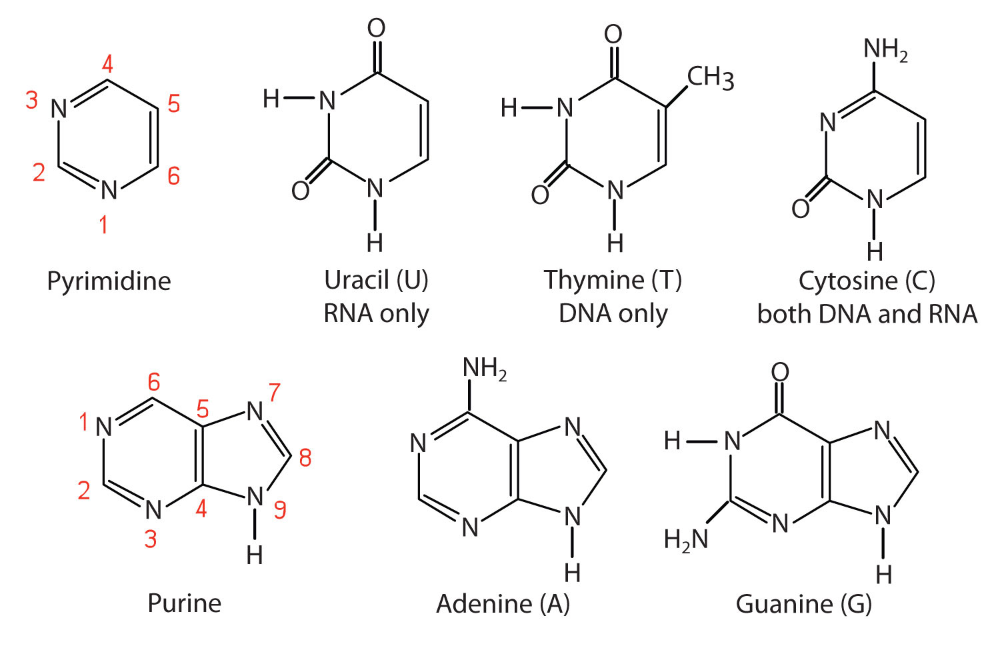

# Biological sequence analysis {#bioseq}

```{r}
knitr::opts_chunk$set(echo=FALSE,
                      message=FALSE,
                      fig.path = "figures/02-",
                      dev = c('png','pdf'),
                      dpi = 300,
                      fig.width=7, fig.height=5)
library(DiagrammeR)
```

## What do we want to achieve today

* Learn the central dogma of molecular biology and its implications in drug discovery
* Understand how biological information is stored in DNA and protein sequences and how can they be analysed
* Understand technical terms including edit distance, Smith-Waterman algorithm, Needleman-Wunsch algorithm, Markov chains
* Know software BLAST, hmmer
* Self-learning with rosalind

## Questions

* Are there other genes other the target X with similar structures to X, that may increase the effect of the drug and/or cause side effects?
* Does it make sense to test drug candidates of target X in mouse, rat, or another model species?
* How variable are the coding sequences of the target X among the general population, and among patients of a certain disease?
* Can we design efficacious and safe RNA-based therapies that target gene X potently and specifically to reverse the disease? 


## Central dogma of molecular biology

To understand how drugs treat diseases, we need to first understand how information is stored in biological systems, how the information or its flow is distorted and interrupted in disease, and how drugs work from an information point of view.

The central dogma of molecular biology is shown in figure \@ref(fig:figCD).

```{r figCD, fig.cap="Central dogma of molecular biology.", out.width="100%", fig.height=0.8}
DiagrammeR::grViz("data/central-dogma.gv")
```

## DNA

The [1BNA](https://www.rcsb.org/3d-view/1BNA) entry of RCSB PDB database is the structure of a piece of DNA. Explore its structure with the interactive *3D view*.

<!--
```{r dna, include=FALSE, eval=FALSE}
library(Rpdb)
dna <- Rpdb::read.pdb("data/1bna.pdb.gz")
visualize(dna)
```
-->

Ech DNA nucleotide is composed of three main units:

* a pentose sguar (5-carbon monosaccharide, or deoxyribose)
* a phosphate group
* a nitrogenous base

They are connected as shown in the bottom panel of figure \@ref(DNAsegment).

```{r DNAsegment, fig.cap="Double-helix structure of DNA, nitrogenous bases pairing, and the molecular structure of a DNA molecule. From the text book [OpenStax Anatomy and Physiology](https://cnx.org/contents/FPtK1zmh@8.25:fEI3C8Ot@10/Preface), discovered through [Wikimedia](https://commons.wikimedia.org/wiki/File:0322_DNA_Nucleotides.jpg), reused under the CC license. "}
knitr::include_graphics("figures/WikimediaDNANucleotides.jpg")
```

While the phosphate group and the nitrogenous base stay constant for each nucleotide, the nitrogenous base varies. An overview of nitrogenous bases that are found in virtually all biological systems can be found in \@ref(fig:DNAbases).

<!--
nucleic acids = repeated nucleotides
nucleotide = H3PO4 + nitrogen base (also known as nitrogenous base) + pentose sugar
nucleoside = nitrogenous base + pentose suguar = nucleotide - phosphoate
-->

```{r DNAbases, fig.cap="Nitrogenous bases. From *The Basics of General, Organic, and Biological Chemistry* (*The Basics of GOB Chemistry*) by David W. Ball, John W. Hill, and Rhonda J. Scott, reused under the CC-BY-NC-SA license. Downloaded from [LibreTexts Chemistry](https://chem.libretexts.org/Bookshelves/Introductory_Chemistry/Book%3A_The_Basics_of_GOB_Chemistry_(Ball_et_al.)/19%3A_Nucleic_Acids/19.1%3A_Nucleotides) on July 31, 2019."}

```

Nitrogenous bases of two anti-parallel DNA strands form pairs: Adenine (A) pairs with Thymine (T), and Guanine (G) pairs with Cytosine (C). In this way, pairs between a purine (A and G) and a pyrimidine (T and C) allow the formation of a double helix with a constant distance between the two backbone strands. The diameter of B-DNA, a common form of DNA, is about 20 Angstroms; one Angstrom is $10^{-10}$m, or 0.1 nanometer; the distance between base pairs is about 3.4 Angstrom. Apparently, pairing between two pyrimidines will take less space, and pairing between two purines will take larger space; in addition, hybrogen bond formation does not allow the pairing between two pyrimidines or purines. Readers that are interested in the physics and chemisty of DNA are encouraged to consult introductory books to biochemistry, for instance *The Basics of General, Organic, and Biological Chemistry* [@ball_basics_2012], which is shared under the Common Creative lisence.

How can we effectively represent DNA sequences? ATGCGTC

## RNA

Almost the same as DNA, but with ribose as the pentose sugar instead of deoxyribose. And it exists mostly as single strand, or forming helix with DNA.

How can we effectively represent RNA sequences? AUGUUC

## Protein

How can we effectivel represent protein sequences?

## The central dogma, revisited

## Drugs target either the nodes or the edges of the graph


## Mathematical concepts and models

### Levenshtein distance (edit distance)

### Substitution matrix

### Linear programming and the Needleman-Wunsch algorithm

### Markov and hidden markov models

## Software

### BLAST

### hmmer

### Biopython

## Resources for further learning

* Rosalind
* [Teaching RNA algorithms](http://rna.informatik.uni-freiburg.de/Teaching/) by Backofen Lab at U Freiburg, with [source code](https://github.com/BackofenLab/RNA-Playground) available on Github.
* [An Introduction to Applied Bioinformatics](http://readiab.org/)
